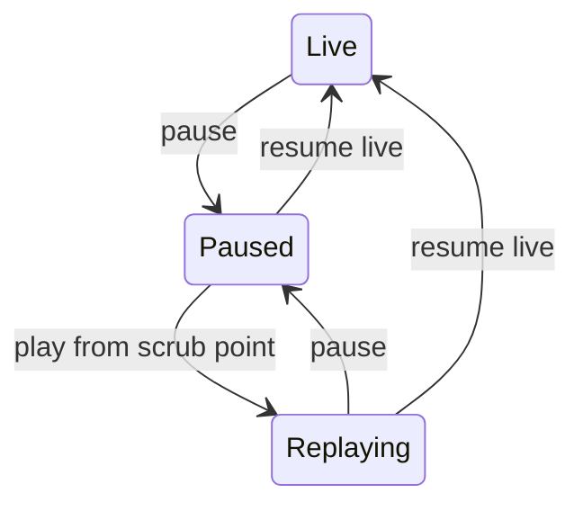
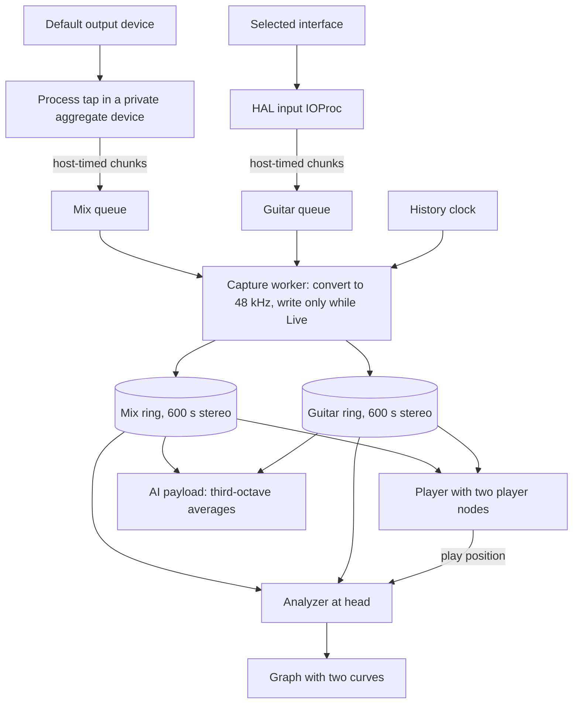
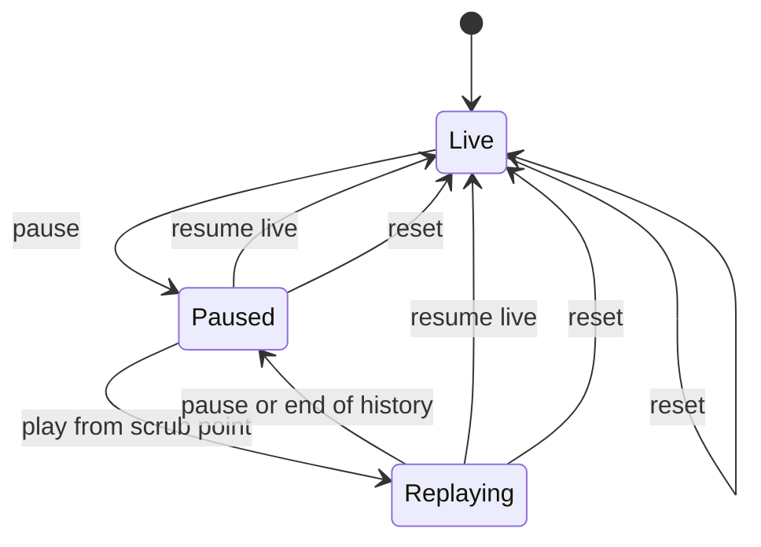
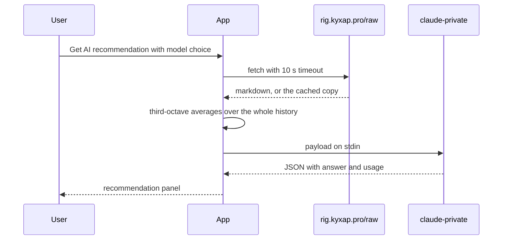
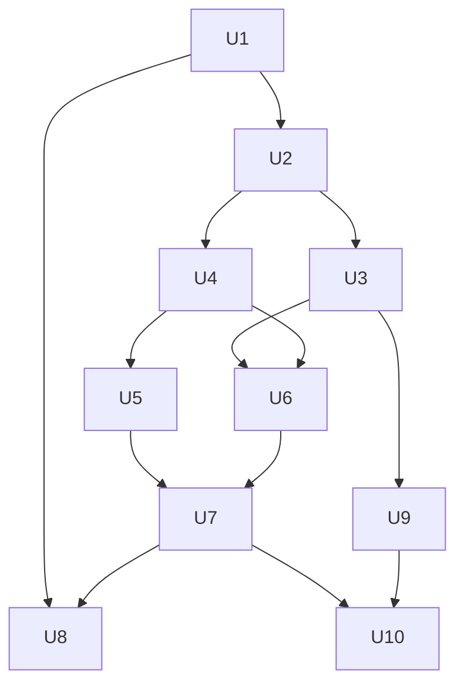

# Spectrum Analyzer - Plan

## Goal Capsule

- **Objective:** While playing guitar along to any track on the Mac, the user sees where the guitar's spectrum sits against the mix, live and over the last 10 minutes, and can re-listen to any moment, so they can tune the pedal EQ until the guitar fills the mix's gaps.
- **Means:** a native Swift macOS app built as a SwiftPM package (KTD1), built and tested locally, released by GitHub Actions on version tags (KTD11), and installed through a cask kept in this repository (KTD12).
- **Product authority:** this Product Contract. Key Decisions marked `session-settled` were made by the user and are not reopened.
- **Planning authority:** the Planning Contract. A KTD wins on mechanism within the constraints of the R-IDs it cites. A unit never overrides either.
- **Execution profile:** `swift build` and `swift test` run on the host with Command Line Tools (Swift 6.2.4, which includes Swift Testing). Xcode is not installed and not needed. Hardware, permission and install checks are manual on the user's Mac.
- **Stop conditions:**
  - The U8 upgrade check shows macOS asking for microphone or system audio permission again after `brew upgrade`. Stop and ask the user whether to use a self-signed certificate (KTD10), because that bends the unsigned-distribution Key Decision.
  - The process tap delivers only zeros with System Audio Recording granted on macOS 26.6. Stop and report, because R1 cannot be met as designed.
- **Optional scope:** U9 and U10 (the AI recommendation, R16–R18) come last. The user can drop them without affecting anything else.
- **Tail ownership:** pushing a `v*` tag, which publishes a release, is the user's call.
- **Open blockers:** none.

---

## Product Contract

### Summary

A native macOS app overlays two live spectrum curves in a window that can be pinned above other apps: everything the Mac plays, and the guitar from selected audio interface inputs.
It keeps the last 10 minutes of audio in memory, so the user can stop playing, scrub back, and replay a moment with both curves following the audio.
Without the interface connected, it shows the mix curve alone.
A Reset button clears the kept history.
An optional button sends the averaged spectra of the whole kept history and the user's rig description to Claude and shows the suggested rig changes.

### Problem Frame

The user plays guitar along to YouTube tracks.
The guitar goes through pedals, where the EQ lives (a Boss GE-7 before the drives and the amp, and the low and high cut on a Mooer Cab X2 after the load box), into a Focusrite Scarlett 18i16 4th Gen in stereo. The user hears it through the interface's direct monitoring, so the Mac never plays the guitar.
To make the guitar sit well in the mix, the user needs to see which frequency ranges the track leaves empty and where the guitar collides with it.
They cannot operate an app while playing, so what happened during a take has to be inspectable afterwards.
They refuse to open a DAW just to play, and they reject extra runtime dependencies.

### Key Decisions

- **Native Swift app, no Python layer.** Capturing system audio requires a Swift-accessible Core Audio API anyway, so Python would only add a second runtime, packaging, and about 100 MB. (session-settled: user-approved — chosen over a Python UI with a bundled Swift capture helper: no benefit left once Swift is unavoidable.)
- **Standalone app, not a DAW setup.** (session-settled: user-directed — chosen over a REAPER track with Loopback inputs and the SPAN plugin: no DAW dependency just to play guitar.) Governs R13.
- **Two curves overlaid on one graph.** (session-settled: user-directed — chosen over one spectrum with a source switch: the collision is visible in a single frame.) Governs R5.
- **Mix comes from system audio capture, not the interface's Loopback channels.** (session-settled: user-directed — chosen over Focusrite Loopback: the mix curve must work without the interface.) Governs R1, R3.
- **Audio replay, not only spectrum history.** (session-settled: user-directed — chosen over a spectrum-only history: the user wants to re-listen, not just re-read the graph.) Governs R9.
- **A rolling 10-minute buffer, not recorded sessions.** Re-listening needs no files or archive, which keeps the app out of DAW territory. (session-settled: user-approved — chosen over session recording with saved takes: 10 minutes covers long tracks.) Governs R8, R15.
- **Unsigned distribution through GitHub only.** (session-settled: user-directed — chosen over signing and notarization: no Apple developer account, certificates, or registries beyond GitHub; the per-update approval friction is accepted.) Governs R12, R14.
- **The AI recommendation is an optional add-on.** The rest of the app must work and ship without it. Governs R16, R17, R18.
- **Recommendations use the rig description from rig.kyxap.pro.** (session-settled: user-directed — chosen over the pedals.kyxap.pro catalog: not every rig device is in the catalog, and the rig carries the signal chain order.) Governs R17.
- **The whole rig document is sent.** (session-settled: user-approved — chosen over sending only the guitar, amp, pedal and chain sections: that halves the tokens but drops power, cabling and specs.) Governs R17.
- **A recommendation covers the whole kept history.** (session-settled: user-directed — chosen over a picker of 30 s to 10 min windows or a scrub selection.) Governs R16.

### Requirements

**Capture**

- R1. The mix curve shows everything the Mac plays through its current output device, whether that is the built-in speakers, headphones, or the Focusrite.
- R2. The guitar curve shows the sum of the interface inputs the user ticks in a checklist, so a stereo guitar is covered by ticking both of its channels.
- R3. When the interface is disconnected or no input is ticked, the app shows the mix curve alone and keeps working.
- R4. Audio the app itself plays during replay never shows up in the mix curve.

**Display**

- R5. Both curves share one graph with frequency on a logarithmic axis from 20 Hz to 20 kHz and level in dB, and each curve is visually distinct.
- R6. Curves are smoothed over a few seconds, so a persistent gap in the mix reads as a stable dip rather than flicker.

**Window**

- R7. One toggle pins the window above all other apps' windows, and the pinned window stays resizable and movable.

**History and replay**

- R8. The app always keeps the last 10 minutes of both sources' audio and spectrum in memory and discards anything older.
- R9. The user can pause, scrub to any point in the kept 10 minutes, and play the audio back from there, with both curves following the playback position.
- R10. Live capture pauses while the user is paused or replaying, and resuming live returns the graph to real time.
- R11. Replay plays the mix and the guitar together.
- R15. A Reset control discards the kept history of both sources, and the app continues live with an empty history.

**Distribution**

- R12. GitHub Actions builds the app and publishes each version to GitHub Releases.
- R13. The user installs and upgrades the app with `brew` from a personal tap hosted on GitHub, and the app lands in `/Applications` with an icon, launchable from Spotlight and the Dock.
- R14. When a required permission (microphone or system audio recording) is missing, the app says which one and where to grant it instead of showing empty curves.

**AI recommendation (optional)**

- R16. One button asks Claude for concrete rig changes, based on the mix and guitar spectra averaged over the whole kept history since launch or the last Reset.
- R17. The request carries the rig description, so a recommendation may name any device in the rig, for example a boost, not only the EQ knobs.
- R18. The user picks Sonnet or Opus for the request and reads the answer in the app, and the request carries only spectrum numbers and text, never audio.

### Key Flows

- F1. Play along, then inspect
  - **Trigger:** The user starts a track on YouTube and picks up the guitar.
  - **Steps:** The user pins the analyzer over the browser and ticks the guitar inputs. They play and watch both curves. They stop, pause the analyzer, scrub back to a passage, and replay it. They adjust the pedal EQ, resume live, and play again.
  - **Covered by:** R2, R5, R7, R8, R9, R10



- F2. Ask for a recommendation
  - **Trigger:** The user has played along for a while and wants a second opinion on the settings.
  - **Steps:** The user picks Sonnet or Opus and presses the recommendation button. The app shows progress, then the answer. The user changes the rig, presses Reset, and plays again, so the next request reflects only the new settings.
  - **Covered by:** R15, R16, R17, R18

### Acceptance Examples

- AE1. **Covers R1, R3.** Given the Focusrite is unplugged and YouTube plays through the MacBook speakers, when the app runs, then the mix curve moves with the track and no guitar curve or error dialog appears.
- AE2. **Covers R2.** Given inputs 1 and 2 are ticked and the guitar is plugged into both in stereo, when the user plays, then one guitar curve reflects both channels.
- AE3. **Covers R4, R10.** Given the user replays a passage, when the replayed mix comes out of the speakers, then neither curve is fed by live capture until the user resumes live.
- AE4. **Covers R8.** Given the app has been running for 25 minutes, when the user scrubs back, then the earliest reachable moment is 10 minutes ago.
- AE5. **Covers R15.** Given 6 minutes of kept history, when the user presses Reset, then the scrub range is empty and both curves continue live from that moment.
- AE6. **Covers R16, R17, R18.** Given 4 minutes of history since the last Reset, when the user asks for a recommendation, then the request contains spectra averaged over those 4 minutes and the rig text, and no audio.
- AE7. **Covers R16.** Given the Claude CLI is not at the configured path, when the user asks for a recommendation, then the app says the CLI was not found at that path.

### Scope Boundaries

- The EQ itself stays on the user's pedals; the app only shows the result and suggestions.
- Applying recommended settings to pedals, for example over MIDI.
- Follow-up chat about a recommendation: one request, one answer.
- Saving recordings or takes to files.
- Capturing a single app (for example, only the browser) instead of the whole system mix.
- Code signing and notarization.
- Platforms other than macOS.
- DAW or plugin forms of the analyzer.

#### Deferred to Follow-Up Work

- CI on every push. Builds and tests run locally to save GitHub Actions minutes (KTD11).

### Dependencies / Assumptions

- The Mac runs macOS 26.6 on Apple silicon; system audio capture without a virtual driver needs macOS 14.2 or later.
- The 10-minute buffer takes about 230 MB of memory for two stereo sources at 16 bits. History is always stored at 48 kHz (KTD4), so a 96 kHz interface does not double it.
- The browser runs in a normal window; pinning over a full-screen Space is not required.
- The first install needs one "Open Anyway" in Privacy & Security. KTD10 is meant to keep later upgrades from asking again and to keep permission grants across upgrades.
- The Claude Code CLI is installed at `~/bin/claude-private` and logged in. One request costs about 7–8k input tokens (the rig is about 6–7k, the spectra under 1k), plus the CLI's own system prompt, which has not been measured yet.
- `https://rig.kyxap.pro/raw` serves the rig as plain markdown (21.7 KB on 2026-09-14).

### Sources / Research

- AudioTee, a Swift CLI capturing system audio through Core Audio taps: https://github.com/makeusabrew/audiotee
- AudioCap, the reference tap sequence (tap, private aggregate device, IOProc) and the `TCCAccessPreflight` permission check: https://github.com/insidegui/AudioCap
- A tap without permission returns `noErr` and silent buffers; `AudioDeviceStart` raises the permission prompt: https://www.thunderkitty.app/learn/2000-buffers-of-nothing/
- A tap does not follow output device or format changes; tap and aggregate device must be recreated: https://github.com/ariso-ai/oats/issues/268
- `CATapDescription` initializers and properties (global stereo tap, `privateTap`, `muteBehavior`, `bundleIDs` from macOS 26): `CoreAudio.framework/Headers/CATapDescription.h` in the Command Line Tools SDK.
- `AVAudioEngine` on macOS is tied to the default input device; redirecting it is unreliable: https://developer.apple.com/forums/thread/71008 and https://github.com/AudioKit/AudioKit/issues/2130
- Homebrew 6.0.22 quarantines cask downloads (`Library/Homebrew/extend/os/mac/cask/quarantine.rb`) and on upgrade carries the user's Gatekeeper approval forward only when the new app satisfies the old app's designated requirement (`Library/Homebrew/cask/upgrade.rb`, `quarantine_release_decision`).
- Homebrew removing `--no-quarantine` and disabling unsigned casks in the official repo: https://github.com/Homebrew/brew/issues/20755
- Ad-hoc signed apps losing permission grants on every rebuild: https://github.com/ssotomayor/discordia/issues/130
- An identifier-pinned designated requirement is stable across rebuilds; a certificate-anchored one is the strongest guarantee: https://github.com/NousResearch/hermes-agent/pull/95091 and https://evoleinik.com/posts/macos-dev-signing-preserve-permissions/
- `macos-26` GitHub-hosted runners are generally available: https://github.blog/changelog/2026-02-26-macos-26-is-now-generally-available-for-github-hosted-runners/
- Claude Code CLI 2.1.272 flags `-p`, `--model`, `--tools ""`, `--safe-mode`, `--output-format`: `claude --help`.
- The rig description: https://rig.kyxap.pro (markdown at `/raw`).
- Scarlett 4th Gen Loopback, the rejected mix source: https://support.focusrite.com/hc/en-gb/articles/13229216604562-Scarlett-4th-Gen-using-Loopback
- Friture, an existing analyzer rejected because it has no system audio capture or two-source overlay and is not notarized: https://github.com/tlecomte/friture
- System audio capture via ScreenCaptureKit from PyObjC failing on macOS 15: https://github.com/ronaldoussoren/pyobjc/issues/647

---

## Planning Contract

**Product Contract preservation:** changed: R15–R18, F2, AE5–AE7 and four Key Decisions added for the Reset control and the optional AI recommendation, which the user requested and confirmed during planning. The Problem Frame corrects the interface model to Scarlett 18i16 4th Gen, per rig.kyxap.pro. Dependencies / Assumptions were updated for fixed 48 kHz storage (KTD4) and the stable signature (KTD10). The three questions deferred to planning are resolved in KTD5, KTD7 and KTD10 and were removed. R1–R14 are unchanged. R8's "spectrum in memory" is met by deriving the spectrum from kept audio (KTD4).

### Key Technical Decisions

- KTD1. **SwiftPM package, no Xcode project.** One executable target (SwiftUI with AppKit where needed) and one Swift Testing target. `scripts/bundle.sh` turns the build into `Spectrum Analyzer.app`: `Info.plist`, an `.icns` made with `sips` and `iconutil`, and the signature (KTD10). The machine has only Command Line Tools, and asset catalogs and `xcodebuild` need Xcode. The deployment target is macOS 26 because the only target machine runs 26.6 and nothing older gets tested. The bundle identifier is `pro.kyxap.SpectrumAnalyzer`.
- KTD2. **Mix capture through a private global process tap.** A stereo global tap that excludes no process, private and unmuted, sits in a private aggregate device whose main sub-device is the current default output device, and an IOProc block reads it (the AudioCap sequence). Listeners on the default output device and the tap format trigger a full rebuild of IOProc, aggregate device and tap, because a tap does not follow device changes. R4 is guaranteed by KTD6, so the tap excludes nothing. If replay bleed ever shows up, excluding the app's own bundle ID through `bundleIDs` is the one-line fix. Governs R1.
- KTD3. **Guitar capture through a HAL IOProc on the selected device, not `AVAudioEngine`.** `AVAudioEngine`'s input node follows the default input device, and redirecting it is reported unreliable. The device's input stream configuration provides the channel list. The selected device UID and its ticked channels persist in `UserDefaults`, and a device-list listener starts and stops capture on hot-plug (R3). The guitar curve analyzes the sum of all ticked channels (R2). History keeps the guitar in stereo: ticked channels alternate left and right in channel order, and a single tick goes to both sides.
- KTD4. **History is two preallocated rings of 600 s at a fixed 48 kHz, 16-bit stereo, on one history clock.** A history frame is (host time − time spent paused since the history started) × 48 000. IOProc threads only copy host-timed chunks into lock-free single-producer queues, built on `Synchronization.Atomic` over preallocated storage. An IOProc block never allocates, locks, logs or touches Swift reference counting, because any of those can glitch the real-time audio thread. One capture worker converts each chunk with `AVAudioConverter` and writes it at its clock-derived frame. That zero-fills gaps such as a disconnected interface and absorbs the drift between the two devices' clocks. The spectrum of any kept moment is computed from kept audio on demand, with no second store. Reset zeroes both rings and restarts the clock (R15). Governs R8, R15.
- KTD5. **Analysis: Accelerate FFT at one head position per source.** An 8192-point Hann-windowed vDSP FFT runs at 30 frames per second. Power maps onto about 240 log-spaced points from 20 Hz to 20 kHz in dBFS. Smoothing is an exponential average of power with a time constant of 1, 3 or 8 s, 3 s by default, chosen in the UI. The analyzer follows a head: small forward steps update incrementally, and a jump (scrub, replay start, Reset) re-warms from the τ seconds before the new head. Live and replay share this path; only the head differs. Governs R5, R6.
- KTD6. **One session state machine gates all writes.** Live, Paused and Replaying follow F1, plus Reset from any state back to Live. The capture worker writes only while Live. Replayed audio may reach the tap, but nothing gets written, and resuming live stops playback before writes resume. Governs R4, R10.
- KTD7. **Replay through `AVAudioEngine` with two player nodes.** Mix and guitar, both stereo at 48 kHz, feed the main mixer on the default output device. Chunks are scheduled from the rings starting at the scrub point, and the player's position drives the analyzer head (KTD5). Reaching the end of kept history switches to Paused. An engine configuration change, such as an output device switch, restarts playback at the current head. There is no per-source mute, because R11 plays both together. Governs R9, R11.
- KTD8. **Pinning through SwiftUI's `windowLevel(.floating)`**, toggled from the session model. The window stays a normal resizable window. Governs R7.
- KTD9. **Permission check.** Microphone status comes from `AVCaptureDevice` authorization for audio. System audio status comes from the private `TCCAccessPreflight` with the `kTCCServiceAudioCapture` service, loaded through `dlopen` from the TCC framework as AudioCap does. A denied tap returns silence and no public API tells the difference. If the symbol is missing, the status is unknown and the app relies on the prompt that `AudioDeviceStart` raises. `NSMicrophoneUsageDescription` and `NSAudioCaptureUsageDescription` are written directly into `Info.plist`. (session-settled: user-approved — chosen over no pre-check: without it a missing grant looks like silence; the private API may break in a later macOS.) Governs R14.
- KTD10. **Ad-hoc signature with a designated requirement pinned to the bundle identifier.** `bundle.sh` signs ad-hoc with the requirement `designated => identifier "pro.kyxap.SpectrumAnalyzer"`. The default ad-hoc requirement pins the cdhash, which changes on every build. TCC stores the designated requirement with each grant, and `brew upgrade` carries the Gatekeeper approval forward only when the new app satisfies the old one's requirement. The fallback, a self-signed code-signing certificate kept in GitHub secrets, needs the user's consent (Goal Capsule stop condition). (session-settled: user-approved — chosen over default ad-hoc signing: every upgrade would need "Open Anyway" and re-granted permissions.) Governs R12, R13, R14.
- KTD11. **GitHub Actions runs only on version tags.** On a `v*` tag, the workflow on `macos-26` runs `swift test`, bundles with the version from the tag, zips with `ditto`, publishes a GitHub Release with `gh`, and updates the cask on `master` with `GITHUB_TOKEN`. (session-settled: user-directed — chosen over CI on every push: saves GitHub Actions minutes; builds and tests run locally.) Governs R12.
- KTD12. **The cask lives in this repository**, in `Casks/spectrum-analyzer.rb`, and the user taps it with `brew tap kyxap1/spectrum-analyzer https://github.com/kyxap1/spectrum-analyzer`. The cask is versioned rather than `:latest` so that plain `brew upgrade` picks up new releases. (session-settled: user-approved — chosen over a separate `homebrew-tap` repository: no second repository or token.) Governs R13.
- KTD13. **The AI request runs the Claude CLI as a child process.** The app starts the CLI at a path from settings, `~/bin/claude-private` by default, with `~` expanded, because apps launched from the Dock do not get the shell's `PATH`. The default is the user's profile wrapper, so the request uses that profile's login. The flags are `-p --model <sonnet|opus> --tools "" --safe-mode --output-format json`, and the payload goes in on stdin. `--safe-mode` keeps the profile's `CLAUDE.md`, hooks and plugins out of the answer while auth and model selection still work; `--bare` is not used because it skips the OAuth login. `--tools ""` leaves the model nothing to do but read the payload. A 180 s timeout and a Cancel button bound the call. The JSON output also reports token usage, which the answer header shows. Governs R16, R18.
- KTD14. **The payload holds third-octave averages over the whole history, not the display curve.** Mean power over 31 ISO third-octave bands from 20 Hz to 20 kHz goes into a text table in dB with mix, guitar and difference columns. It is computed at a coarse hop of one FFT every 0.5 s. Frames quieter than a −70 dBFS RMS floor are left out of each source's average, so pauses and a disconnected interface do not drag the levels down. The payload reports how many seconds of each source went into the average. Governs R16, R18.
- KTD15. **The rig text is fetched at request time.** The app fetches `https://rig.kyxap.pro/raw` with a 10 s timeout. It caches the last good copy in Application Support and falls back to it, noting the cache date in the payload. The URL is a setting. Governs R17.

### High-Level Technical Design

Data flow from the two capture paths through history to the graph, replay and the AI payload:



Session states, extending F1 with the end of history and Reset:



The AI request (F2):



The write index, the analyzer head, and the tap lifecycle. This is directional pseudo-code, not an implementation:

```text
on chunk(hostTime, samples, rate):
  if session is not Live: drop
  frames = convert(samples, rate -> 48000)
  expected = ring.head
  byClock = clock.frame(hostTime)
  at = (|byClock - expected| < 10 ms) ? expected : byClock
  ring.write(at, frames)                      # zero-fills [expected, at) when at > expected

analyzer.advance(to head):
  if 0 < head - last <= 2 hops: fold the new hops into the exponential average
  else: reset the average, then fold hops over [head - tau, head] at a coarse hop

on default output change or tap format change:
  stop IOProc; destroy IOProc, aggregate device, tap
  create tap (global stereo, private) -> aggregate (main = new default output, taps = [tap]) -> IOProc -> start
```

### Output Structure

```text
Package.swift
.gitignore
README.md
Bundle/
  Info.plist
  AppIcon.png
Sources/SpectrumAnalyzer/
  App/SpectrumAnalyzerApp.swift
  App/Session.swift
  Capture/AudioDevices.swift
  Capture/MixTap.swift
  Capture/InterfaceInput.swift
  Capture/CaptureWorker.swift
  History/HistoryRing.swift
  History/HistoryClock.swift
  History/SPSCQueue.swift
  Analysis/Spectrum.swift
  Replay/Player.swift
  Permissions/Permissions.swift
  UI/SpectrumGraph.swift
  UI/ControlsBar.swift
  UI/InputsPanel.swift
  UI/AdvicePanel.swift
  Advice/Bands.swift
  Advice/Payload.swift
  Advice/RigSource.swift
  Advice/AdviceRunner.swift
Tests/SpectrumAnalyzerTests/
scripts/bundle.sh
scripts/bump-cask.sh
Casks/spectrum-analyzer.rb
.github/workflows/release.yml
```

### Sequencing

U1 comes first. U2 and U3 are pure logic and can be written test-first before any hardware work. U4 through U7 bring up capture, replay and the UI. U8 ships, and U9 and U10 are the optional AI part.



### Deferred to Implementation

- The exact System Settings URL anchors for the Microphone and System Audio Recording panes.
- Whether the tap's aggregate device keeps delivering buffers while nothing plays. The history clock does not depend on it.
- The field names for the answer text and token usage in `claude -p --output-format json`.
- The app icon artwork.
- Converter chunk sizes and queue capacities.

### Risks & Dependencies

| Risk | Effect | Mitigation |
|---|---|---|
| macOS changes or removes the private `TCCAccessPreflight` | System audio status reads as unknown | Fall back to the system prompt; the microphone check stays public API (KTD9) |
| TCC does not honor the identifier-pinned requirement | Permissions re-prompt after each upgrade | U8 upgrade check; self-signed certificate only with consent (KTD10) |
| Core Audio taps are thinly documented and marked unstable by AudioTee | Capture edge cases on device switches | Follow the AudioCap sequence, rebuild on every device or format change, manual AE1 check |
| Homebrew's recent quarantine-inheritance code changes | One "Open Anyway" per upgrade again | Accepted friction in the unsigned-distribution Key Decision |
| Claude CLI flags change (`--safe-mode`, `--tools ""`) | The AI request fails | The error shows in the panel; flags verified on CLI 2.1.272 |
| rig.kyxap.pro is down or changes format | The request lacks the rig context | Cached copy with its date (KTD15) |
| Branch protection added on `master` later | The release workflow cannot bump the cask | The release still publishes; the failed bump step is visible in Actions |

---

## Implementation Units

| U-ID | Title | Key files | Depends on |
|---|---|---|---|
| U1 | Package, bundle and signing | `Package.swift`, `scripts/bundle.sh`, `Bundle/Info.plist` | — |
| U2 | History store and clock | `Sources/SpectrumAnalyzer/History/` | U1 |
| U3 | Spectrum analysis | `Sources/SpectrumAnalyzer/Analysis/` | U2 |
| U4 | Mix capture through a process tap | `Capture/MixTap.swift`, `Capture/CaptureWorker.swift` | U2 |
| U5 | Interface input capture | `Capture/InterfaceInput.swift` | U4 |
| U6 | Session state and replay | `App/Session.swift`, `Replay/Player.swift` | U3, U4 |
| U7 | Main window and permissions | `Sources/SpectrumAnalyzer/UI/`, `Permissions/Permissions.swift` | U5, U6 |
| U8 | Release workflow and cask | `.github/workflows/release.yml`, `Casks/spectrum-analyzer.rb` | U1, U7 |
| U9 | AI payload and rig source (optional) | `Advice/Bands.swift`, `Advice/Payload.swift`, `Advice/RigSource.swift` | U3 |
| U10 | AI request and panel (optional) | `Advice/AdviceRunner.swift`, `UI/AdvicePanel.swift` | U7, U9 |

### U1. Package, bundle and signing

**Goal:** An empty SwiftUI window app that builds with `swift build` and becomes a signed, launchable `Spectrum Analyzer.app` with an icon.

**Requirements:** R13; KTD1, KTD10.

**Dependencies:** none.

**Files:**
- `Package.swift`
- `.gitignore`
- `Sources/SpectrumAnalyzer/App/SpectrumAnalyzerApp.swift`
- `Bundle/Info.plist`
- `Bundle/AppIcon.png`
- `scripts/bundle.sh`
- `Tests/SpectrumAnalyzerTests/SmokeTests.swift`

**Approach:**
1. The package has one executable target and one Swift Testing target, with platform macOS 26.
2. `Info.plist` carries the bundle identifier, the version placeholders, `LSMinimumSystemVersion`, both usage descriptions (KTD9) and the icon file name.
3. `bundle.sh` takes a version, runs a release build, assembles `Contents/MacOS` and `Contents/Resources`, builds the `.icns` from the 1024 px PNG, stamps the version, signs per KTD10, and verifies the signature.

**Execution note:** This is packaging; prove it with the bundle smoke checks rather than unit coverage.

**Test scenarios:**
- Test expectation: none -- scaffolding; the smoke test only proves the test target builds and runs.

**Verification:**
- `bundle.sh 0.0.1` produces `Spectrum Analyzer.app`.
- `codesign -d -r-` prints a requirement naming only the identifier.
- `plutil -p` shows both usage descriptions.
- The app opens from Finder and shows its icon and an empty window.

### U2. History store and clock

**Goal:** Two 10-minute rings on one history clock, with gap fill, Reset, and reads by position.

**Requirements:** R8, R15, AE4, AE5; KTD4.

**Dependencies:** U1.

**Files:**
- `Sources/SpectrumAnalyzer/History/HistoryRing.swift`
- `Sources/SpectrumAnalyzer/History/HistoryClock.swift`
- `Sources/SpectrumAnalyzer/History/SPSCQueue.swift`
- `Tests/SpectrumAnalyzerTests/HistoryTests.swift`

**Approach:**
1. The ring stores interleaved 16-bit stereo frames for a fixed capacity, overwrites the oldest data, and exposes the kept range as the span from the head minus capacity to the head.
2. A read outside the kept range returns zeros.
3. The clock maps host time to history frames and excludes paused intervals.
4. The queue is single-producer, single-consumer, and never blocks the real-time producer. On overflow it drops the chunk and counts the drop.

**Execution note:** Implement test-first; this is pure logic with exact boundaries.

**Test scenarios:**
- Covers AE4. After 25 minutes of frames written at 48 kHz, the earliest readable frame is exactly 10 minutes before the head.
- A write that crosses the end of the ring reads back identically across the wrap.
- A chunk whose clock frame is 2 s after the previous chunk's end leaves 2 s of zeros between them.
- A chunk arriving 3 ms off the contiguous position is appended contiguously; a chunk 50 ms off lands at its clock frame.
- 30 s Live, then 20 s paused, then 10 s Live puts the head at 40 s.
- Covers AE5. Reset after 6 minutes leaves an empty range, reads return zeros, and the next write starts at frame 0.
- A read that starts before the kept range returns zeros for the discarded part and real data for the rest.
- The queue delivers chunks in order, and when full it drops new chunks and counts them without blocking.

**Verification:** `swift test` passes for the history tests.

### U3. Spectrum analysis

**Goal:** Smoothed spectra per source at any head, as display points.

**Requirements:** R5, R6; KTD5.

**Dependencies:** U2.

**Files:**
- `Sources/SpectrumAnalyzer/Analysis/Spectrum.swift`
- `Tests/SpectrumAnalyzerTests/SpectrumTests.swift`

**Approach:**
1. For each source, sum the power of both channels after the FFT, then map it to the log-spaced display points.
2. Smoothing and the incremental-versus-re-warm head logic follow KTD5.

**Execution note:** Implement test-first against synthetic signals.

**Test scenarios:**
- A 1 kHz sine at −12 dBFS peaks at the display point nearest 1 kHz and reads about −12 dB after window correction.
- 20 Hz and 20 kHz map to the first and last display points, and spacing is monotonic on a log scale.
- Silence yields the display floor, never NaN or −inf.
- A step from silence to a tone reaches about 63% of the final power after 3 s of incremental advance with τ = 3 s.
- Jumping the head 5 minutes back gives the same result as analyzing only the τ seconds before the new head, with nothing left over from the old position.

**Verification:** `swift test` passes for the spectrum tests.

### U4. Mix capture through a process tap

**Goal:** System output flows into the mix ring and keeps flowing when the output device changes.

**Requirements:** R1, R3, AE1; KTD2, KTD4, KTD6.

**Dependencies:** U2.

**Files:**
- `Sources/SpectrumAnalyzer/Capture/AudioDevices.swift`
- `Sources/SpectrumAnalyzer/Capture/MixTap.swift`
- `Sources/SpectrumAnalyzer/Capture/CaptureWorker.swift`
- `Tests/SpectrumAnalyzerTests/CaptureWorkerTests.swift`

**Approach:**
1. `AudioDevices` reads the default output UID and the input devices with their channel counts, and registers listeners for default output and device-list changes.
2. `MixTap` creates the tap, the aggregate device and the IOProc in the KTD2 order, pushes host-timed chunks into the mix queue, and rebuilds everything on a device or format change.
3. `CaptureWorker` drains both queues, converts to 48 kHz, and writes through the history clock while Live (KTD4, KTD6).
4. A failed creation step publishes a mix-unavailable status with its `OSStatus`, which U7 shows. The next device change retries.

**Patterns to follow:** the AudioCap tap sequence (see Sources / Research).

**Test scenarios:**
- A 1 s chunk of 44.1 kHz float audio becomes 48 000 frames at the clock-derived position.
- Two chunks from different sources with interleaved host times land at their own clock positions in their own rings.
- Chunks drained while not Live are discarded, and the head does not move.
- Float samples beyond ±1.0 clip to the 16-bit range instead of wrapping.

**Verification:**
- The worker tests pass.
- Manual, covers AE1: with the Focusrite unplugged and YouTube on the MacBook speakers, the mix ring fills and no dialog appears.
- Manual: plugging in headphones mid-track keeps the mix flowing after the rebuild.

### U5. Interface input capture

**Goal:** Ticked interface channels flow into the guitar ring, and capture survives unplugging and replugging.

**Requirements:** R2, R3, AE2; KTD3.

**Dependencies:** U4.

**Files:**
- `Sources/SpectrumAnalyzer/Capture/InterfaceInput.swift`
- `Tests/SpectrumAnalyzerTests/ChannelMixTests.swift`

**Approach:**
1. Open a HAL IOProc on the saved device UID and push host-timed chunks into the guitar queue.
2. Map the ticked channels to the stored stereo pair and to the analysis sum per KTD3.
3. When the device disappears, stop, and the history clock zero-fills the gap. When it reappears, restart with the saved ticks.
4. If the device cannot be opened, the guitar curve is hidden and the inputs panel shows the `OSStatus`. The mix keeps running (R3).

**Test scenarios:**
- With ticks {1, 2}, history stores channel 1 left and channel 2 right, and the analysis source is the sum of both.
- With tick {3}, channel 3 goes to both sides.
- With ticks {1, 2, 5}, channels 1 and 5 go left, channel 2 goes right, and the analysis sums all three.
- With no ticks, nothing is written for the guitar, and the curve is hidden (R3).
- Saved ticks restore when the device UID reappears, and ticks beyond the device's channel count are dropped.

**Verification:**
- The channel tests pass.
- Manual, covers AE2: inputs 1 and 2 ticked with a stereo guitar show one guitar curve.
- Manual: unplugging the Scarlett mid-take leaves the mix curve running with no dialog.

### U6. Session state and replay

**Goal:** Live, Paused and Replaying with Reset, replay from the scrub point, and curves following playback.

**Requirements:** R4, R9, R10, R11, R15, F1, AE3, AE5; KTD6, KTD7.

**Dependencies:** U3, U4.

**Files:**
- `Sources/SpectrumAnalyzer/App/Session.swift`
- `Sources/SpectrumAnalyzer/Replay/Player.swift`
- `Tests/SpectrumAnalyzerTests/SessionTests.swift`

**Approach:**
1. `Session` is the observable main-actor model. It owns the state, the live flag the worker reads, the head that feeds the analyzer (live head, play position or scrub position), and Reset.
2. `Player` schedules ring chunks to the two player nodes from a start frame, reports its position, and signals the end of history.
3. Engine configuration changes restart playback at the current head (KTD7).

**Test scenarios:**
- Each F1 transition works: pause, play from the scrub point, pause, resume live from Paused, and resume live from Replaying.
- Play while Live is ignored.
- Covers AE3. During 5 s of replay, the history head does not move. After resuming live, writes continue from the paused head, because the clock excludes paused time.
- Scrubbing while Paused moves the analyzer head to the scrub position, and scrubbing while Replaying seeks the player.
- Replay that reaches the history head switches to Paused at the end.
- Covers AE5. Reset during replay stops the player, empties history, and leaves the session Live.
- With a fake output clock, the play position maps to the start frame plus the rendered frames.

**Verification:**
- The session tests pass.
- Manual: F1 end to end on the Mac, including hearing both mix and guitar in replay (R11).

### U7. Main window and permissions

**Goal:** The graph, transport, input checklist, pin toggle, smoothing picker, Reset, and permission banners.

**Requirements:** R5, R7, R9, R14, R15; KTD5, KTD8, KTD9.

**Dependencies:** U5, U6.

**Files:**
- `Sources/SpectrumAnalyzer/UI/SpectrumGraph.swift`
- `Sources/SpectrumAnalyzer/UI/ControlsBar.swift`
- `Sources/SpectrumAnalyzer/UI/InputsPanel.swift`
- `Sources/SpectrumAnalyzer/Permissions/Permissions.swift`
- `Tests/SpectrumAnalyzerTests/PermissionsTests.swift`
- `Tests/SpectrumAnalyzerTests/GraphScaleTests.swift`

**Approach:**
1. The graph draws two differently colored curves with a legend, frequency grid lines at 20, 50, 100, 200, 500 Hz, 1, 2, 5, 10 and 20 kHz, and dB grid lines. It redraws at 30 frames per second.
2. The controls bar holds pause, play and resume live, a scrubber over the kept range with m:ss labels, Reset, the pin toggle and the smoothing picker.
3. The inputs panel holds a device menu and a channel checklist.
4. `Permissions` maps both statuses to banners. Each banner names the permission and has a button that opens System Settings.
5. On launch, a not-determined microphone status triggers `AVCaptureDevice.requestAccess(for: .audio)` before the interface IOProc starts, so the prompt appears at once instead of the input silently returning zeros.

**Test scenarios:**
- A not-determined microphone status requests access once; authorized and denied statuses do not.
- Microphone denied with system audio authorized shows one banner naming Microphone.
- Both denied shows two banners.
- With the private check unavailable, no system audio banner appears.
- A mix-unavailable status from U4 shows a banner with its `OSStatus`.
- The graph maps 20 Hz to x = 0, 20 kHz to the full width and 1 kHz to its log position, and maps 0 dB to the top and the floor to the bottom.
- The scrubber labels 0 to 600 s as m:ss.

**Verification:**
- The UI logic tests pass.
- Manual, R7: the pinned window stays above the browser and can still be resized and moved.
- Manual, R14: revoking the microphone in System Settings shows a banner naming Microphone.

### U8. Release workflow and cask

**Goal:** A version tag publishes a release and updates the cask, and brew installs and upgrades the app.

**Requirements:** R12, R13; KTD10, KTD11, KTD12.

**Dependencies:** U1, U7.

**Files:**
- `.github/workflows/release.yml`
- `Casks/spectrum-analyzer.rb`
- `scripts/bump-cask.sh`
- `README.md`

**Approach:**
1. The workflow runs on `v*` tags on `macos-26` with `contents: write`: `swift test`, then `bundle.sh` with the tag version, a `ditto` zip, the release with `gh`, and finally `bump-cask.sh` and a commit to `master`.
2. The cask has a versioned release asset URL, `sha256`, an `app` stanza, `depends_on arch: :arm64`, and a `zap` for preferences and the Application Support cache.
3. The README gives the tap and install commands and the one-time "Open Anyway" step.

**Execution note:** This is packaging; verify it with a real tag and a real install on the Mac.

**Test scenarios:**
- Test expectation: none -- release plumbing; proven by the release and upgrade checks below.

**Verification:**
- `brew style Casks/spectrum-analyzer.rb` is clean.
- Tag `v0.1.0`: the release carries the zip, and the cask on `master` has the matching version and checksum.
- `brew tap` and `brew install --cask` put the app in `/Applications`, where Spotlight and the Dock find it with its icon. The first launch needs "Open Anyway". Grant the microphone and system audio.
- Tag `v0.1.1`, then run `brew upgrade`: the app opens without "Open Anyway" and without asking for permissions again. If it asks again, apply the Goal Capsule stop condition.

### U9. AI payload and rig source (optional)

**Goal:** Build the request text from the whole-history spectra and the rig markdown.

**Requirements:** R16, R17, R18, AE6; KTD14, KTD15.

**Dependencies:** U3.

**Files:**
- `Sources/SpectrumAnalyzer/Advice/Bands.swift`
- `Sources/SpectrumAnalyzer/Advice/Payload.swift`
- `Sources/SpectrumAnalyzer/Advice/RigSource.swift`
- `Tests/SpectrumAnalyzerTests/PayloadTests.swift`

**Approach:**
1. `Bands` aggregates the U3 FFT power into the 31 ISO third-octave bands.
2. `Payload` walks the kept history at the KTD14 hop, averages band power per source above the silence floor, and renders a fixed instruction, the band table, the analyzed seconds and the rig text.
3. `RigSource` fetches, caches and falls back per KTD15.

**Execution note:** Implement test-first; the payload is pure logic over the rings.

**Test scenarios:**
- A 100 Hz tone lands in the 100 Hz third-octave band, and white noise rises about 3 dB per band.
- Covers AE6. With 4 minutes of history since Reset, the payload reports 240 s analyzed per source and has 31 band rows with mix, guitar and difference columns.
- 2 minutes of guitar followed by 2 minutes of silence give the same guitar band levels as the 2 minutes alone, and the payload reports 120 s of guitar.
- With no guitar audio at all, the payload says the guitar was not captured and carries the mix only.
- When the rig fetch fails, the cached copy is used and its date appears in the payload. With no cache, the request is refused with a reason.
- The payload contains no sample data and stays under 30 KB including the rig.

**Verification:** `swift test` passes for the payload tests.

### U10. AI request and panel (optional)

**Goal:** A button with a model picker runs the CLI and shows the answer.

**Requirements:** R16, R18, F2, AE7; KTD13.

**Dependencies:** U7, U9.

**Files:**
- `Sources/SpectrumAnalyzer/Advice/AdviceRunner.swift`
- `Sources/SpectrumAnalyzer/UI/AdvicePanel.swift`
- `Tests/SpectrumAnalyzerTests/AdviceRunnerTests.swift`

**Approach:**
1. `AdviceRunner` starts the CLI per KTD13, writes the payload to stdin, parses the JSON result, and enforces the timeout and Cancel.
2. `AdvicePanel` renders the answer as markdown, shows the model and the token usage, and shows errors in place. The button is disabled while the kept history is empty. The settings hold the CLI path, `~/bin/claude-private` by default, and the rig URL.

**Test scenarios:**
- Tests use a stub CLI script written to a temporary directory.
- A stub printing valid JSON yields the answer text and parsed usage.
- Picking Opus passes `--model opus` along with `-p`, `--tools ""` and `--safe-mode`.
- A CLI path set to `~/…` is expanded to the home directory.
- With an empty history the button is disabled; after one write it is enabled.
- The stub receives on stdin exactly the payload that U9 built.
- A stub exiting with status 1 shows the tail of its stderr.
- Covers AE7. A missing CLI path shows that the CLI was not found at that path.
- A stub sleeping past the timeout is terminated, and a timeout error is shown.

**Verification:**
- The runner tests pass.
- Manual: one real Sonnet request returns an answer, and its input token count is recorded to check the 7–8k estimate.

---

## Verification Contract

Everything runs locally on the host (KTD11). The release workflow repeats `swift test` and the bundle step on tags. Every manual check runs on the `.app` from `scripts/bundle.sh`, never on `swift run`: a bare binary has no bundle id or usage descriptions, so TCC grants go to Terminal and capture behaves differently.

| Gate | Check | Applies to |
|---|---|---|
| Build | `swift build` | all units |
| Unit tests | `swift test` | U2, U3, U4, U5, U6, U7, U9, U10 |
| Bundle smoke | `scripts/bundle.sh <version>`, then `codesign --verify --deep --strict`, `codesign -d -r-` showing an identifier-only requirement, and `plutil -p` showing both usage descriptions | U1, U8 |
| Cask lint | `brew style Casks/spectrum-analyzer.rb` | U8 |
| Hardware checklist | Manual on the Mac: AE1, AE2, F1 with AE3, AE4, AE5, R7, R11, R14 | U4, U5, U6, U7 |
| Release and upgrade | Manual: install `v0.1.0`, upgrade to `v0.1.1` without "Open Anyway" or permission prompts | U8 |
| AI smoke | Manual: one real Sonnet request, input tokens recorded | U10 |

---

## Definition of Done

- R1–R15 are met, and each is proven by its unit tests or by the hardware checklist.
- If U9 and U10 are in scope, R16–R18 are met. If the user drops them, no advice code, settings or UI remain.
- `swift test` is green, and the bundle smoke passes.
- The `v0.1.0` → `v0.1.1` brew upgrade check passes, or the stop condition has been raised with the user.
- The README install steps work as written.
- No code from abandoned approaches remains in the diff.
- Each unit's Verification holds.
