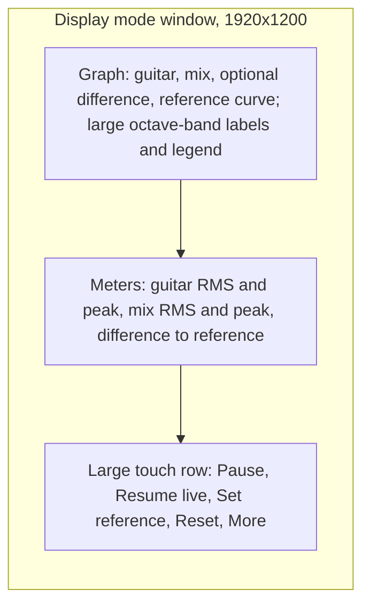
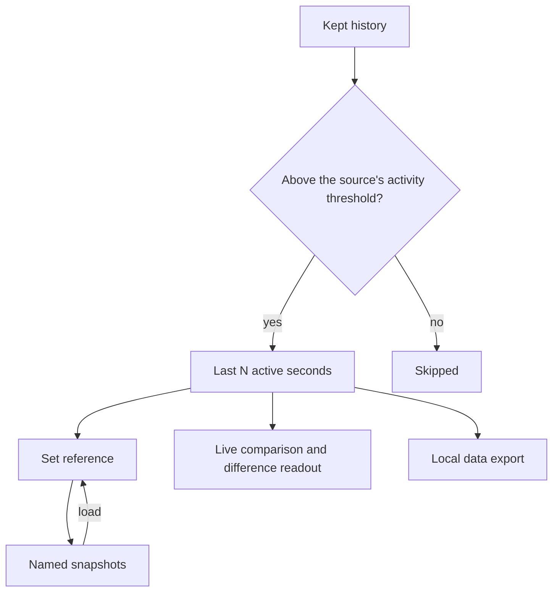
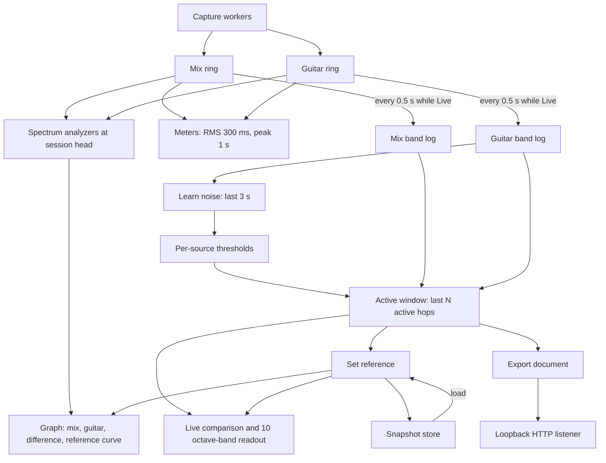
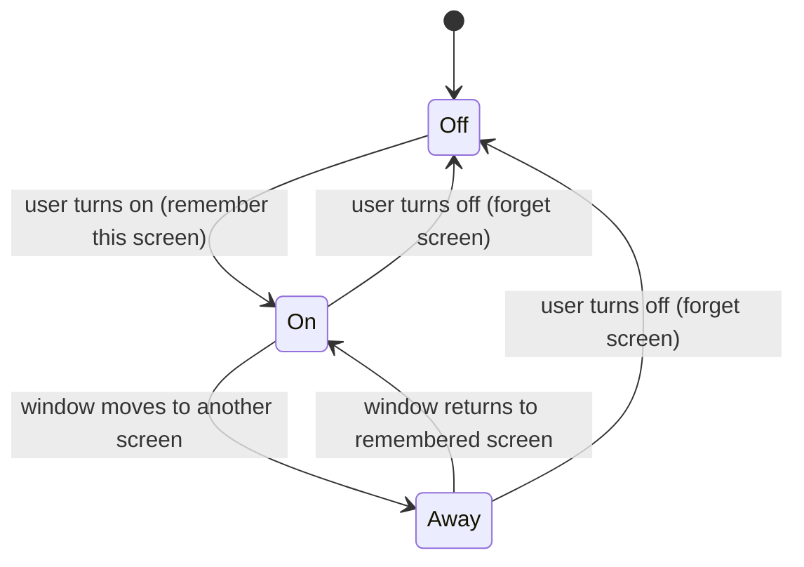
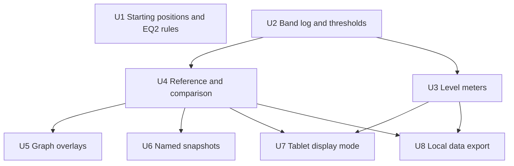

# Pedal Setup Tools - Plan

## Goal Capsule

- **Objective:** While setting up pedals and the two EQ2 units, the user can bring each pedal to unity and see what it does to the tone against a reference. They can read the analyzer from across the room on a tablet. The AI advice and the data an external agent reads match the rig as it is now.
- **Means:** one log of half-second level and band measurements per source, filled while Live, feeds the reference, the live comparison, Learn noise and the export (KTD2). Starting positions move to a third shipped, editable resource (KTD1).
- **Product authority:** this Product Contract. It extends `docs/plans/2026-09-14-2054-feat-spectrum-analyzer-plan.md`, whose session-settled Key Decisions, real-time rules (its KTD4) and Scope Boundaries still hold. KTD numbers in this plan are local to it; the first plan's decisions are cited as "first plan KTD<N>".
- **Stop conditions:** stop and ask if a requirement would need saved audio, a network listener reachable from another machine, or code inside an IOProc block. Stop if the first plan's KTD4 real-time rules would have to bend.
- **Execution profile:** eight units, dependency-ordered (see Sequencing). Pure logic is test-first with Swift Testing; display mode, touch and the export's network behaviour also need the manual checks in the Verification Contract.
- **Tail ownership:** the executor owns tests and a working bundle. Releases follow `.github/workflows/ci.yml` on merge to `master`.
- **Open blockers:** none.

---

## Product Contract

**Product Contract preservation:** changed: R2 — its scope is clarified to devices whose controls change level or tone, and Terraform, Collider and Plethora X1 entries were added after a manual check the user confirmed during planning. Changed: R18 — its difference is taken over moments when guitar and mix were captured together, which the user approved in the 2026-10-06 review. R8, R10 and the grid Key Decision name the 10 bands as standard octave bands that match the EQ2 factory bands, since many devices in the rig shape the tone, not only the EQ2. The four questions deferred to planning are resolved in KTD4, KTD5, KTD6, KTD9, KTD11 and KTD12 and were removed. The Summary gains one sentence on the approach. Everything else is unchanged.

### Summary

This iteration fixes the AI advice for the new rig and adds tools for setting up pedals.
The advice gets an editable list of starting positions and an EQ2 rule that matches the pedal.
The app gains level meters and a retroactive A/B reference for unity gain, a difference curve, and named saved references.
It also gets a touch-friendly display mode for a tablet and an opt-in local read-only data feed for an external agent.
One per-source log of half-second measurements, taken while Live, feeds the reference, the comparison and the feed; the feed is plain HTTP on the loopback interface.

### Problem Frame

The rig changed after the first plan. A BOSS GE-7 used to sit before the drives. Now two Source Audio EQ2 units do the EQ: "EQ2 (pre-amp)" after the NS-1X noise gate, and "EQ2 (post-cab)" after the Mooer Cab X2. The Tone City Matcha Cream and Bad Horse are gone. A Fortin Fuzz))) and an MXR Timmy now sit last before the amp INPUT.

The AI instruction still lists starting positions for the GE-7, Matcha Green and Bad Horse. It also tells the model to move EQ sliders in 2.5 dB steps, which fits the GE-7 and not the EQ2. That contradicts the rig document the same request carries.

The user sets pedals to unity by ear and has no way to see what switching a pedal on does to level and tone. Pauses in playing ruin any naive average, and the noise floor is unknown: everything after the amp keeps hissing when the NS-1X gate closes.

The analyzer will live full screen on a 10-inch tablet seen from a distance, where today's labels and controls are too small to read or touch.

### Key Decisions

- **Starting positions live in their own editable text, not in the instruction.** Positions are rig state and change with the pedals. Keeping them apart from the instruction means editing one never freezes the other. (session-settled: user-approved — chosen over keeping them in `prompt.md` and over a section in rig.kyxap.pro: a pedal change then needs no release, and the rig document stays a list of hardware.) Governs R1, R2.
- **Starting positions come from the manuals, with gaps filled by labeled assumptions.** (session-settled: user-approved — chosen over the user's own current positions and over giving new devices no positions at all.) Governs R2.
- **EQ2 advice uses whole dB per band and may move a band's frequency or Q.** One encoder click on the pedal is 1 dB. The finer 0.2 dB steps exist only in the Neuro app, and the measurement cannot resolve them anyway. (session-settled: user-approved — chosen over levels only at factory frequencies and over 0.2 dB Neuro steps: the user edits on the pedal and uses its parametric controls.) Governs R3.
- **The reference is retroactive: the last N active seconds before the press.** The app already keeps 10 minutes of history, and hands are busy with the guitar. (session-settled: user-approved — chosen over capturing the next N seconds after the press and over a manual start/stop capture.) Governs R7, R8.
- **A saved snapshot is a named reference.** One mechanism serves A/B, per-song comparison and export. Snapshots hold band levels only, never audio, so they do not reopen the "no saved takes" decision. (session-settled: user-approved — chosen over a whole-history average and over a copy of the smoothed display curve.) Governs R12, R13.
- **The activity threshold is learned per source, not fixed at −70 dBFS.** (session-settled: user-approved — chosen over a numeric setting alone and over automatic estimation from history: the rig's noise after the gate is unmeasured, and automatic estimation fails when the user plays without pauses.) Governs R6.
- **The graph grid follows the 10 standard octave bands, which match the EQ2 factory bands; the analysis resolution stays as it is.** The user reads the graph in terms of the knobs they turn, and octave bands describe what any EQ in the rig does: the amp, both EQ2 units, Collider and Timmy alike. Governs R10.
- **The tablet gets a single window with large touch controls, switched manually and remembered per display.** (session-settled: user-approved — chosen over a single window with controls collapsed behind a menu, over a separate display-only window, and over manual-only or full-screen-triggered switching: after MIDI was dropped, a tap on the tablet is the only way to press Set reference while playing.) Governs R14, R15, R16.
- **The export serves the same active-seconds window as the reference.** Silence while the user turns an EQ2 knob must not read as a tone change. (session-settled: user-approved — chosen over the smoothed display curves and over serving both.) Governs R18.
- **No MIDI control in this iteration.** (session-settled: user-directed — chosen over CoreMIDI input with learnable Note/CC mapping and timeline markers: nothing on the board sends a foot-triggered Note or CC, only RC-5 clock, start/stop and program change, and hands-free control is not needed now.)
- **Effects with level or tone controls get starting-position entries too.** Plethora X1, Terraform and Collider all change level or tone in the measured signal. (session-settled: user-approved — chosen over listing only drives, EQs, booster, amp and cab sim: the manuals show output-level and tone controls on all three.) Governs R2.

### Requirements

**AI advice matches the rig**

- R1. The AI instruction contains no device-specific starting positions. They come from a separate list that is shipped with the app, editable in the app next to the prompt, and sent with every request.
- R2. The shipped list covers every device in the rig whose controls change level or tone, and drops the GE-7, Matcha Green and Bad Horse. Entries for devices that stay in the rig keep their current positions. New entries come from pedals.kyxap.pro where the manual gives a starting point, and the list marks every other value as an assumption.
  - From the manuals: MXR Timmy VOLUME and GAIN at 12 o'clock with BASS and TREBLE fully clockwise. Both EQ2 units flat at the factory band frequencies, Q 1.0, OUTPUT at 12 o'clock, which is unity. Wampler Terraform VOLUME at 12 o'clock, which is 0 dB. Source Audio Collider output level (ALT MIX in Cascade Mode) at 12 o'clock, which is unity.
  - Assumptions, where the manuals are silent: Timmy CLIP in the middle position. Fortin Fuzz))) Level, Gain and Girth at 12 o'clock. Collider in Cascade Mode.
  - TC Electronic Plethora X1 gets an entry without knob positions: its A, B and C knobs control whichever TonePrint is loaded, which the player notes name.
  - Other devices (NS-1X, Soul Press II, XS-1, RC-5) get an entry only when their manual shows a level or tone control the player sets and leaves; an expression sweep does not count.
- R3. EQ2 advice names the unit (pre-amp or post-cab), the band and the change in whole dB. It may suggest moving a band's frequency or Q when a problem sits between bands, and it gives an OUTPUT change in dB with its knob position.
- R4. Advice names multi-position switches by position: left, middle or right for the Timmy CLIP, and 0 or 1 for two-position toggles.

**Levels and reference**

- R5. Guitar and mix each show a live RMS level and a peak level in dBFS.
- R6. Each source has an activity threshold. "Learn noise", pressed while not playing, sets it to the level measured over the last few seconds plus 10 dB. The value is shown, editable and remembered, and is −60 dBFS until first learned; a source in digital silence keeps its current value. Reference, export and the AI payload all use this threshold to decide which moments count.
- R7. "Set reference" stores the guitar's overall level and band levels averaged over the last N active seconds before the press. N is 5, 10 or 20 seconds, 10 by default.
- R8. While a reference is set, the app shows the live guitar's overall level difference in dB and its difference at each of the 10 octave bands, both over the last N active seconds. The readout is marked partial until N active seconds have accumulated since the press.
- R9. One reference exists at a time. It survives Reset and lasts until the user clears it or quits the app.

**Graph**

- R10. Frequency grid lines and axis labels sit at the 10 standard octave bands, labelled as on the EQ2: 31, 62, 125, 250, 500 Hz and 1, 2, 4, 8, 16 kHz. Analysis resolution does not change.
- R11. An optional third curve shows guitar minus mix, toggled by the user, visually distinct from the other curves, and read against its own scale centred on 0 dB.
- R12. The current reference can be saved under a name, for example a song and part. A saved snapshot holds band levels for guitar and mix and no audio. Snapshots persist across launches and can be renamed and deleted.
- R13. Any saved snapshot can be loaded as the current reference. The current reference shows on the graph as a curve against the live guitar.

**Tablet display mode**

- R14. Display mode enlarges axis labels, the legend, meter readouts and reference differences so they read from about 2 m on a 10-inch 1920×1200 screen.
- R15. Display mode shows a row of large touch targets for Pause, Resume live, Set reference and Reset. Every other control stays reachable through one large "More" control.
- R16. The user turns display mode on or off by hand. The app remembers the display it was turned on for and switches it on and off as the window moves onto and off that display. Nothing in the app is specific to Side Screen or to the tablet model.



**Local data export**

- R17. The export is off by default. When on, it serves read-only data to clients on the same Mac and refuses everything else.
- R18. A response holds the 31 third-octave band levels for guitar, mix and their difference over the last N active seconds, with the difference taken over moments when both were captured at the same time. It also holds the RMS and peak levels, the reference and its differences when one is set, the session state (Live, Paused or Replaying), the active seconds accumulated, and a timestamp.
- R19. The format is self-describing and versioned. It carries units and band centre frequencies, so an MCP server can pass it through without translation.

One window of the last N active seconds, gated by the R6 threshold, feeds every comparison surface:



### Key Flows

- F1. Set a pedal to unity
  - **Trigger:** The user adds or adjusts a pedal and wants it neither louder nor quieter than bypass.
  - **Steps:** With the pedal off, the user plays for at least N seconds and taps Set reference. They switch the pedal on and keep playing. They read the overall difference and adjust the pedal's level until it sits near 0 dB. Then they read the band differences to see what the pedal does to the tone.
  - **Covered by:** R5, R6, R7, R8, R15
- F2. Compare against a saved part
  - **Trigger:** The user returns to a song whose guitar they saved earlier.
  - **Steps:** The user loads "Song — chorus" as the reference and plays the part. The graph shows the saved curve against the live guitar, and the readout shows the band differences.
  - **Covered by:** R12, R13, R8
- F3. Agent-assisted EQ2 tuning
  - **Trigger:** The user wants an external agent to watch the spectrum while they turn the EQ2 units.
  - **Steps:** The user enables the export. The agent reads it repeatedly. The user plays a phrase, stops to turn a knob, and plays again. The pauses do not count toward the bands the agent reads.
  - **Covered by:** R6, R17, R18, R19

### Acceptance Examples

- AE1. **Covers R7, R8.** Given N is 10 s, when the user plays 12 s with the pedal off, rests for 20 s, and taps Set reference, then the reference holds the last 10 s of playing and ignores the rest. After switching the pedal on and playing 4 s, the readout is marked partial. After 10 active seconds, the mark goes away.
- AE2. **Covers R6.** Given the guitar input idles at −62 dBFS of hiss, when the user taps Learn noise without playing, then the guitar threshold becomes −52 dBFS. A later 30 s pause with the same hiss adds nothing to the active seconds.
- AE3. **Covers R9.** Given a reference is set, when the user presses Reset, then history empties and the reference and its readout remain.
- AE4. **Covers R16.** Given display mode was turned on while the window was on the tablet display, when the window moves to the Mac's built-in display, then display mode turns off. When the window moves back, it turns on again.
- AE5. **Covers R17.** Given the export is off, then nothing listens. Given it is on, a request from another machine on the network is refused.
- AE6. **Covers R1, R2, R3.** Given the shipped defaults, when the user asks for a recommendation, then the request names no GE-7, Matcha Green or Bad Horse positions. It carries the EQ2, Timmy and Fortin starting positions, and the instruction asks for EQ2 changes in whole dB.
- AE7. **Covers R12.** Given a snapshot named "Song — chorus" was saved, when the app is relaunched, then the snapshot is still listed, and its stored data holds band levels and no samples.

### Scope Boundaries

- MIDI input and timeline markers on the scrubber.
- An MCP server, any write or command through the export, and access from other machines. Commands come in a follow-up (see Deferred to Follow-Up Work); access from other machines stays out.
- Saving audio of any kind. Snapshots stay band levels only.
- A/B reference on the mix source. The reference is guitar only.
- Following EQ2 band frequency edits on the graph grid. The grid shows the fixed octave bands only.
- Detecting the tablet or Side Screen automatically, or anything specific to them.
- Applying settings to pedals over MIDI, as before.

#### Deferred to Follow-Up Work

- Building the AI payload's whole-history averages from the band log instead of re-running FFTs over the ring. It would remove a pass of about 1,200 FFTs per request, but the payload works today and this iteration only changes its threshold.
- Agent control through the export. A local agent that already turns pedal parameters through the guitar MIDI controller's MCP server will close the loop with this app: start and stop capture, Set reference, Learn noise, Reset and choose N without the UI, then read the data it needs for analysis. It runs on the same Mac, so the loopback-only boundary holds. This iteration ships the read side; the listener, `/levels` path and versioned document are the base the commands extend, so nothing here may assume the export stays read-only for good.

### Dependencies / Assumptions

- Rig facts come from `https://rig.kyxap.pro/raw` as of 2026-10-06. Control facts come from pedals.kyxap.pro: the EQ2 bands go ±18 dB in 1 dB encoder steps, frequency is settable from 20 Hz to 20 kHz, Q from 0.5 to 10, and OUTPUT runs from −∞ to +12 dB with unity at 12 o'clock. Terraform VOLUME runs −6 dB to +6 dB with 0 dB at centre. Collider ALT MIX runs from silence to +6 dB with unity at 12 o'clock in Cascade Mode.
- The signal chain puts Plethora X1, Fortin and Timmy on the direct path into the amp INPUT, and Terraform and Collider after EQ2 (post-cab), before the RC-5 and the Scarlett.
- The tablet is an Amazon Fire HD 10 (13th gen) used through Side Screen as a 1920×1200 display with touch passed through as clicks. Whether Side Screen supports Fire OS has not been checked.
- The viewing distance of about 2 m is an assumption used to size display mode.
- The noise level at the Scarlett inputs has not been measured. R6 exists to calibrate it on the real rig.
- The stored list of engaged pedals still names "Tone City Matcha Green". It does no harm, because only names present in the current rig are reported.
- No custom prompt is stored in the app's `UserDefaults` on the user's Mac (checked 2026-10-06), so the new shipped prompt applies without a manual reset.
- Releases no longer follow the first plan's KTD11 and KTD12. `.github/workflows/ci.yml` tests every pull request and releases every push to `master` into the `kyxap1/homebrew-spectrum-analyzer` tap.

### Sources / Research

- First plan, whose decisions this one extends: `docs/plans/2026-09-14-2054-feat-spectrum-analyzer-plan.md`
- AI instruction with the stale positions and the 2.5 dB rule: `Sources/SpectrumAnalyzer/Advice/prompt.md`
- Prompt and fetch-domain editing, stored in `UserDefaults` only while different from the shipped default: `Sources/SpectrumAnalyzer/Advice/AdviceSettings.swift`
- Fixed −70 dBFS activity floor and the guitar-minus-mix column: `Sources/SpectrumAnalyzer/Advice/Payload.swift`
- Current frequency grid at 20, 50, 100 Hz and so on: `Sources/SpectrumAnalyzer/UI/SpectrumGraph.swift`
- Engaged-pedal state filtered by the rig's pedal table: `Sources/SpectrumAnalyzer/Advice/RigSource.swift` (`RigPedals`)
- Source Audio EQ2 manual: https://pedals.kyxap.pro/source-audio-eq2/
- MXR Timmy manual, starting positions and CLIP modes: https://pedals.kyxap.pro/mxr-timmy/#directions
- Fortin Fuzz))) manual, controls without starting positions: https://pedals.kyxap.pro/fortin-fuzz/
- Wampler Terraform controls, VOLUME range: https://pedals.kyxap.pro/wampler-terraform/#quick-start
- Source Audio Collider controls, MIX, ALT MIX and TONE: https://pedals.kyxap.pro/source-audio-collider/#controls
- TC Electronic Plethora X1 controls, shared A/B/C knobs: https://pedals.kyxap.pro/tc-electronic-plethora-x1/#controls
- BOSS RC-5 MIDI output (clock, start/stop, program change only): https://pedals.kyxap.pro/boss-rc-5/#midi-out
- Alesis SR18 MIDI note output and MIDI THRU merge: https://pedals.kyxap.pro/alesis-sr18/#midi-notes-out

---

## Planning Contract

### Key Technical Decisions

- KTD1. **Starting positions ship as a third resource, `Advice/starting-positions.md`, handled like the prompt.** `AdviceSettings` loads and stores it under its own key, kept in `UserDefaults` only while it differs from the default. `Payload.render` adds it as its own labelled section after the rig state, and `prompt.md` refers to "the starting positions in this request". The file joins `prompt.md` in `Package.swift` resources and in the copy step of `scripts/bundle.sh`. (session-settled: user-approved — chosen over keeping positions in `prompt.md` and over a section in rig.kyxap.pro.) Governs R1, R2.
- KTD2. **One band log per source, filled only while Live.** Every 0.5 s of history (the existing `Payload.hopSeconds`), the log stores the 8192-frame window's RMS in dBFS, its 31 third-octave powers and its 240 display-point powers. One FFT yields all three. Each log advances to its own ring's `head`, which is what has actually been written, so an idle interface does not stall the mix. Whenever a ring's head has moved more than two hops past the log's last position, in any session state, the log jumps to the head without back-filling. A device that starts or reconnects after a long idle spell then costs no burst of FFTs, and the skipped span is zero-filled silence that would never pass a threshold anyway. Capacity matches the 600 s of history (1,200 hops), and Reset empties both logs. Gating happens at read time, so editing a threshold applies at once. Hops are computed in the existing 30 fps `tick` on the main actor; at one FFT per source per 0.5 s this adds about a fifteenth of the analyzer's own FFT load. Governs R6, R7, R8, R18.
- KTD3. **The active window walks the log back from its newest hop.** It keeps hops whose RMS is at or above the source's threshold until it has N / 0.5 of them, then averages power, not dB. The overall level is the mean RMS power of the same hops, in dBFS. Active seconds are counted hops × 0.5 s. "Partial" means fewer than N / 0.5 active hops have been logged since the reference was set or loaded. The log numbers every appended hop with a sequence number that never goes back, and the reference keeps the number current at the press; the hops after it are gated at read time with the current threshold, so a threshold edit mid-count applies at once like everywhere else. Reset moves the kept number to the log's current one, which restarts the count, since the live window it measured is gone. While a reference is set, the live window for the comparison takes only hops logged since the reference was set or loaded, so it never mixes in the hops the reference was built from; while partial it holds fewer than N / 0.5 hops. The export's plain guitar and mix bands keep the unbounded window. The export's guitar-minus-mix difference uses the guitar's active hops and, for each, the mix hop that ends on the same frame; guitar hops with no mix hop at that frame are skipped. Both logs place hops on the same frame grid (multiples of the hop length), so a paired hop is the same moment in both sources, and a backing track playing on while the guitar rests never pairs with an older guitar phrase. While Paused or Replaying the logs do not grow, so the readout holds still. Set reference while Paused uses the hops before the pause, not the scrub point. Governs R7, R8, R18.
- KTD4. **Thresholds and Learn noise.** Each source's threshold is a `UserDefaults` value, −60 dBFS until first set. Learn noise averages the RMS power of the source's last 6 hops (3 s), active or not, and adds 10 dB. If every one of those hops is digital silence, the threshold keeps its value. Learn noise works only while Live and once 6 hops have been logged since the last Reset or return to Live; otherwise it refuses with a message, so it never learns the playing before a pause. `Payload.analyze` takes the threshold as a parameter in place of `silenceFloorDBFS`, so the AI payload gates with the learned value. Governs R6.
- KTD5. **An octave band level is the power sum of three third-octave bands.** Each of the 10 ISO octave centres (31.5 Hz to 16 kHz, the EQ2 factory bands) is also a third-octave centre, and the band sums it with its two neighbours, one octave in all. An EQ2 band at Q 1.0 spans about that much, and the sum is steadier than one third-octave band. The 20 Hz band falls outside every group. Chosen over the centre band alone. Governs R8.
- KTD6. **Meters read the ring at the analyzer head on every tick.** RMS covers the last 300 ms. Peak is the largest absolute sample in the last 1 s. Both use interleaved samples the way `Payload`'s RMS gate does. Because they follow `session.currentHead`, they show replayed levels during replay. Governs R5.
- KTD7. **The reference is a value on `AppModel`, outside `Session` and the logs.** It holds the guitar's level, its 31 band powers and 240 display powers, the mix's level and 31 band powers when the mix had active hops, the window length, the active seconds it was built from, and an optional snapshot name. No mix display powers are kept, since every curve drawn against the reference is guitar only. Reset never touches it. Set reference with no active guitar hops refuses with a message. The outcome of every Set reference, stored with its active seconds or refused, shows in a status line in `LevelsPanel` next to the touch row, in normal and display mode alike. With fewer than N active seconds it stores what exists and shows its active seconds. Changing N affects the live window and the next Set reference, not the stored reference. Governs R7, R9, R12.
- KTD8. **Snapshots live in one JSON file, `snapshots.json`, in `Application Support/Spectrum Analyzer`.** This follows `FileRigCache`. Each snapshot is a named reference with an id and a date, written atomically on every save, rename or delete. A file that fails to decode is renamed to `snapshots.json.bad` before the list starts empty, so a bad write never wipes saved parts. Loading a snapshot makes it the current reference and restarts the partial count. Governs R12, R13.
- KTD9. **Graph overlays.** Grid lines and labels move to the 10 octave bands, labelled with the rounded values from R10 (31, 62, 125 Hz …); the ISO centres in KTD5 (31.5, 63 Hz …) are only for grouping third-octave bands. The difference curve is the live guitar display curve minus the mix display curve. It is drawn dashed in its own colour against a ±30 dB scale with 0 dB at mid-height and labels on the right edge, shown only when guitar is captured. The difference toggle is remembered. The reference curve is the reference's 240 display powers, drawn dashed in a dimmed guitar colour on the main dB scale, so it compares directly with the live guitar line. Governs R10, R11, R13.
- KTD10. **Display mode is a flag on `AppModel` plus a remembered screen name.** A small `NSViewRepresentable` reports the window's screen through `NSWindow.didChangeScreenNotification`. Screens are matched by `NSScreen.localizedName`; no screen identity the tablet or Side Screen exposes is relied on beyond that name. Turning display mode on remembers the current screen's name, and turning it off forgets it. On a screen change the flag follows whether the new screen has the remembered name. The layout and type sizes come from one environment value, so every view scales from the same switch. (session-settled: user-approved — single window, switched by hand and remembered per display; inherits the Product Key Decision.) Governs R14, R15, R16.
- KTD11. **The export is HTTP/1.1 on 127.0.0.1 through `Network.framework`'s `NWListener`.** The listener binds to the loopback address by setting `NWParameters.requiredLocalEndpoint` to 127.0.0.1 on the chosen port, and also closes any connection whose remote endpoint is not loopback, as a second layer. Port 47800 is the default, overridable through a hidden `export.port` `UserDefaults` key the way `advice.rigURL` is. `GET /levels` returns the JSON document from KTD12 with `Cache-Control: no-store`. Any other path gets 404, any other method gets 405, and every connection closes after one response. The response bytes are rebuilt on the main actor at each hop and on every session state change, so a pause shows up even though the logs stop growing, and are handed to the listener queue through a `Mutex` from `Synchronization`. Turning the export off cancels the listener, and a port already in use shows as an error next to the toggle. The enabled flag is remembered and starts off. Chosen over a JSON file rewritten every 0.5 s: that writes to disk twice a second and needs filesystem access from the agent. Governs R17, R18, R19.
- KTD12. **The export document is versioned JSON with units and centres inline.** Its shape is sketched in High-Level Technical Design. A version bump is required for any field rename or removal; added fields keep the version. Governs R18, R19.

### High-Level Technical Design

Data flow from capture to every comparison surface (KTD2, KTD3, KTD6):



Export document, version 1. This sketch is directional; field names may change during implementation if the self-describing intent holds:

```json
{
  "format": "spectrum-analyzer.levels",
  "version": 1,
  "timestamp": "2026-10-06T09:55:00Z",
  "state": "live",
  "windowSeconds": 10,
  "units": { "level": "dBFS", "band": "dB re full scale, power summed per band" },
  "bands": { "centersHz": [20, 25, 31.5, "... 31 values ..."], "octaveCentersHz": [31.5, 63, 125, "... 10 values ..."] },
  "guitar": { "thresholdDBFS": -52, "activeSeconds": 10, "activeHopsTotal": 412, "newestActiveAgeSeconds": 0.5, "rmsDBFS": -18.2, "peakDBFS": -6.1, "bandsDB": ["... 31 ..."] },
  "mix": { "thresholdDBFS": -60, "activeSeconds": 10, "activeHopsTotal": 980, "newestActiveAgeSeconds": 0.5, "rmsDBFS": -20.4, "peakDBFS": -3.0, "bandsDB": ["... 31 ..."] },
  "difference": { "bandsDB": ["... 31, guitar minus mix ..."] },
  "reference": null
}
```

Per source, `activeHopsTotal` counts active hops since the last Reset and only grows, and `newestActiveAgeSeconds` is the age of the newest hop in the window, so an agent can wait until the window has turned over since its last suggestion. When set, `reference` holds its name, window and active seconds, level and 31 bands, its 10 octave-band levels, the live guitar's differences (level, 10 octave bands, 31 bands), and `partial`.

Display mode across screens (KTD10):



### Sequencing



U1 is independent and can land first. U2 through U8 follow the arrows.

### System-Wide Impact

- **AI payload:** the gate moves from −70 dBFS to the learned threshold, −60 until learned, so a request may count fewer quiet seconds than before.
- **Main-thread load:** two more FFTs per 0.5 s and two short ring reads per tick on the main actor (KTD2, KTD6). Nothing touches the IOProc path or the capture queues, so the first plan's KTD4 holds.
- **Network surface:** the app gains its first listening socket, loopback only and off by default (KTD11).
- **Stored state:** new `UserDefaults` keys for starting positions, thresholds, window seconds, the difference toggle, the display-mode screen name and the export flag and port, plus `snapshots.json` in Application Support.

### Risks & Dependencies

| Risk | Mitigation |
|---|---|
| Side Screen may not run on Fire OS, or may rename its virtual display between sessions. | Display mode works on any screen by hand. A renamed screen only loses the auto switch; the user turns it on again. Checked on the real tablet (Verification Contract). |
| macOS may show a firewall prompt for a listening app even on loopback. | Not verified. Checked by hand when the export is first turned on; the toggle keeps the listener off until the user asks. |
| The learned threshold sits above quiet playing, so soft passages stop counting. | The value is shown and editable (R6); the readout shows active seconds, so a stalled count is visible. |
| Pedal manuals for NS-1X, Soul Press II, XS-1 and RC-5 were not read during planning. | U1 reads them and applies the rule in R2. |

### Deferred to Implementation

- The exact numbers in `starting-positions.md` for devices not named in R2, after U1 reads their manuals.
- Type sizes and touch-target sizes for display mode, tuned on the tablet against R14. The starting point is axis labels of about 20 pt, readouts of about 40 pt and touch targets at least 88 pt tall.
- Whether `fftPowerSpectrum`'s per-call `vDSP` setup needs caching once the log adds its FFTs. Profile first.

---

## Implementation Units

### U1. Starting positions and EQ2 advice rules

- **Goal:** the AI request carries the current rig's starting positions from an editable list, and the instruction asks for EQ2 and switch changes the way R3 and R4 state them.
- **Requirements:** R1, R2, R3, R4, AE6. KTD1.
- **Dependencies:** none.
- **Files:**
  - `Sources/SpectrumAnalyzer/Advice/starting-positions.md` (new)
  - `Sources/SpectrumAnalyzer/Advice/prompt.md`
  - `Sources/SpectrumAnalyzer/Advice/AdviceSettings.swift`
  - `Sources/SpectrumAnalyzer/Advice/Payload.swift`
  - `Sources/SpectrumAnalyzer/App/SpectrumAnalyzerApp.swift`
  - `Sources/SpectrumAnalyzer/UI/AdvicePanel.swift`
  - `Package.swift`
  - `scripts/bundle.sh`
  - `Tests/SpectrumAnalyzerTests/PayloadTests.swift`
- **Approach:**
  1. Move the "Default positions" list out of `prompt.md` into `starting-positions.md`. Drop the GE-7, Matcha Green and Bad Horse entries, and add the entries R2 names.
  2. Read the NS-1X, Soul Press II, XS-1 and RC-5 manuals on pedals.kyxap.pro and add entries per the R2 rule.
  3. Rewrite the prompt's EQ sentence for R3, extend its toggle sentence for R4, and point both of its references to default positions ("listed at the end of this instruction" and "the default positions above") at the starting positions section.
  4. Add a published `startingPositions` property on `AppModel` with the same load/store pattern as `advicePrompt`, and pass it to `Payload.render`.
  5. Add a "Starting positions" editor with its own Reset to Default to `AdviceSettingsSheet`, above the fetch domains.
- **Patterns to follow:** `AdviceSettings.load`/`store` and `defaultPrompt`, `AdviceSettingsSheet`'s per-field reset, and `bundle.sh`'s resource copy line.
- **Test scenarios:**
  - Covers AE6. Rendering with the shipped prompt and shipped starting positions yields text that contains no "GE-7", "Matcha" or "Bad Horse", and does contain "EQ2", "Timmy" and "Fortin".
  - Covers AE6. The shipped prompt asks for EQ2 changes in whole dB and no longer contains "2.5 dB".
  - The shipped prompt contains no positions list: no "Default positions" heading and none of the names Wampler, Timmy, Fortin, Terraform, Collider, Plethora, Spark or Ravager.
  - Edited starting positions passed to `Payload.render` appear in the output under their section heading, after the rig state and before the previous round.
  - Storing starting positions equal to the default removes the stored key, and a different value is stored and read back.
- **Verification:** the scenarios pass, and a bundle built by `scripts/bundle.sh` contains `starting-positions.md` in `Contents/Resources`.

### U2. Band log and activity thresholds

- **Goal:** each source keeps half-second level and band measurements while Live, gated by a learned, editable threshold that the AI payload also uses.
- **Requirements:** R6, AE2. KTD2, KTD3, KTD4.
- **Dependencies:** none.
- **Files:**
  - `Sources/SpectrumAnalyzer/Levels/BandLog.swift` (new)
  - `Sources/SpectrumAnalyzer/Analysis/Spectrum.swift`
  - `Sources/SpectrumAnalyzer/Advice/Payload.swift`
  - `Sources/SpectrumAnalyzer/App/SpectrumAnalyzerApp.swift`
  - `Tests/SpectrumAnalyzerTests/BandLogTests.swift` (new)
  - `Tests/SpectrumAnalyzerTests/PayloadTests.swift`
- **Approach:**
  1. Make the display-point mapping in `SpectrumAnalyzer` and `Payload`'s private `rmsDBFS` callable from outside, so the log reuses them rather than copying them.
  2. Write `BandLog` as a plain type: append hops up to a ring's `head`, reset, return the active window for a threshold and N, and learn noise. It holds no reference to `Session`.
  3. In `AppModel.tick`, while the session is Live, advance both logs after draining. In `reset()`, reset them.
  4. Add published, remembered thresholds per source and a Learn noise action per source.
  5. Give `Payload.analyze` a threshold parameter and pass each source's threshold from `requestAdvice`.
- **Execution note:** implement `BandLog` test-first against synthetic rings from `AudioFixtures`.
- **Patterns to follow:** `Payload.analyze`'s hop loop and RMS gate, and `HistoryRing`'s pure-logic tests in `HistoryTests.swift`.
- **Test scenarios:**
  - A ring with a 12 s tone, 20 s of silence and nothing after yields a 10 s window built only from tone hops.
  - Covers AE2. Hiss at −62 dBFS with Learn noise gives a threshold of −52 dBFS ±0.5, and a further 30 s of the same hiss adds no active hops.
  - Learn noise over digital silence leaves the threshold unchanged.
  - Learn noise while Paused, or with fewer than 6 hops since Reset, refuses and leaves the threshold unchanged.
  - Lowering the threshold below the hiss makes previously skipped hops count, with no re-append.
  - Appending beyond 1,200 hops drops the oldest, and the window still returns the newest active ones.
  - Reset empties the log, and the window then reports 0 active seconds.
  - Advancing to a ring head that has not moved appends nothing.
  - Advancing to a head minutes past the log's position appends at most two hops.
  - `Payload.analyze` with a threshold above a tone's RMS reports 0 analysed seconds, and below it reports the tone's duration.
- **Verification:** the scenarios pass, and existing `PayloadTests` pass with the threshold made explicit.

### U3. Level meters

- **Goal:** guitar and mix each show live RMS and peak in dBFS.
- **Requirements:** R5. KTD6.
- **Dependencies:** U2, for the shared RMS helper.
- **Files:**
  - `Sources/SpectrumAnalyzer/Levels/LevelMeter.swift` (new)
  - `Sources/SpectrumAnalyzer/UI/LevelsPanel.swift` (new)
  - `Sources/SpectrumAnalyzer/App/SpectrumAnalyzerApp.swift`
  - `Tests/SpectrumAnalyzerTests/LevelMeterTests.swift` (new)
- **Approach:** a pure function reads a ring at a head and returns RMS and peak. `AppModel.tick` publishes both for each source. A new `LevelsPanel`, placed between the graph and `ControlsBar`, shows them as numbers and bars, and shows the guitar meter as unavailable when the guitar is not captured.
- **Patterns to follow:** the RMS helper U2 made shared; the meter, the log and the payload gate all use that one implementation.
- **Test scenarios:**
  - A full-scale sine reads about −3 dBFS RMS and about 0 dBFS peak.
  - A 0.5 full-scale burst 0.8 s before the head shows in peak but not in the 300 ms RMS.
  - Silence reads as minus infinity and renders as "−∞".
  - A head less than 1 s into history reads without crashing, with frames before 0 treated as silence.
- **Verification:** the scenarios pass, and the meters move with playing and follow replay on the running app.

### U4. Reference and live comparison

- **Goal:** Set reference captures the last N active guitar seconds, and the panel shows overall and 10 octave-band differences with a partial mark.
- **Requirements:** R7, R8, R9, F1, AE1, AE3. KTD3, KTD5, KTD7.
- **Dependencies:** U2.
- **Files:**
  - `Sources/SpectrumAnalyzer/Levels/Reference.swift` (new)
  - `Sources/SpectrumAnalyzer/App/SpectrumAnalyzerApp.swift`
  - `Sources/SpectrumAnalyzer/UI/LevelsPanel.swift`
  - `Tests/SpectrumAnalyzerTests/ReferenceTests.swift` (new)
- **Approach:**
  1. `Reference.swift` holds the reference value, the octave grouping from KTD5, and a pure comparison that turns a reference and a window into differences and a partial flag.
  2. `AppModel` gains `setReference`, `clearReference`, a remembered window length (5, 10 or 20 s), and a published readout recomputed whenever a log grows.
  3. `LevelsPanel` gains Set reference, Clear, the N picker, Learn noise per source with an editable threshold field, the readout and the Set reference status line. The readout shows the overall difference and each of the 10 octave-band differences as a signed number with a bar centred on 0 dB, bands in frequency order; the sizes are tuned on the tablet in U7. With no active hops since the press, the readout shows dashes and its active-seconds count, never 0 dB.
- **Patterns to follow:** `AppModel`'s `UserDefaults`-backed `@Published` properties.
- **Test scenarios:**
  - Covers AE1. After a 12 s pedal-off tone, 20 s of rest and Set reference, the reference reports 10 active seconds and the tone's level.
  - Covers AE1. After 4 s of a 6 dB louder tone, the comparison is partial with an overall difference near +6 dB. After 10 active seconds it is no longer partial.
  - Covers AE3. Resetting the log after Set reference leaves the reference unchanged, and the next comparison is partial with 0 active seconds.
  - A tone at 1 kHz raises the 1 kHz octave band difference and leaves the 62 Hz band near 0 dB.
  - The 31.5 Hz octave band sums the 25, 31.5 and 40 Hz bands, and the 16 kHz band sums 12.5, 16 and 20 kHz.
  - Set reference with no active guitar hops returns no reference.
  - Right after Set reference, the comparison has 0 active seconds and no differences, not differences of 0 dB.
  - Set reference with 6 of 10 s active stores 6 active seconds.
- **Verification:** the scenarios pass, and F1 works end to end on the rig: a pedal at unity reads within about 1 dB of 0.

### U5. Graph overlays

- **Goal:** the graph uses octave-band gridlines and can show the difference curve and the reference curve.
- **Requirements:** R10, R11, R13. KTD9.
- **Dependencies:** U4.
- **Files:**
  - `Sources/SpectrumAnalyzer/UI/SpectrumGraph.swift`
  - `Sources/SpectrumAnalyzer/UI/ControlsBar.swift`
  - `Sources/SpectrumAnalyzer/App/SpectrumAnalyzerApp.swift`
  - `Tests/SpectrumAnalyzerTests/GraphScaleTests.swift`
- **Approach:** change `GraphScale.frequencyGridLines` to the octave bands. Add a difference-scale mapping to `GraphScale`. Give `SpectrumGraphView` optional difference and reference point arrays with legend entries. `ContentView` passes them, and a remembered "Difference" toggle in `ControlsBar` drives the difference curve.
- **Patterns to follow:** `GraphScale`'s pure mappings and the existing edge-label anchoring.
- **Test scenarios:**
  - Grid labels read "31", "62", "125", "250", "500", "1k", "2k", "4k", "8k", "16k".
  - 0 dB on the difference scale maps to mid-height, +30 dB to the top and −30 dB to the bottom, with values beyond clamped.
- **Verification:** the scenarios pass, and on screen the three curves are visually distinct, with the difference labels on the right edge.

### U6. Named snapshots

- **Goal:** the current reference can be saved under a name, listed, renamed, deleted and loaded back after a relaunch.
- **Requirements:** R12, R13, F2, AE7. KTD7, KTD8.
- **Dependencies:** U4.
- **Files:**
  - `Sources/SpectrumAnalyzer/Levels/SnapshotStore.swift` (new)
  - `Sources/SpectrumAnalyzer/UI/LevelsPanel.swift`
  - `Sources/SpectrumAnalyzer/App/SpectrumAnalyzerApp.swift`
  - `Tests/SpectrumAnalyzerTests/SnapshotStoreTests.swift` (new)
- **Approach:** the store takes a file URL, defaulting to Application Support, so tests use a temporary directory. `LevelsPanel` gains "Save as…", enabled while a reference is set, and a Snapshots sheet with Load, Rename and Delete.
- **Patterns to follow:** `FileRigCache` for the directory and atomic writes.
- **Test scenarios:**
  - Covers AE7. Saving "Song — chorus" and opening a new store on the same URL lists it, and the file holds band powers and no sample arrays.
  - Rename and delete persist across a new store on the same URL.
  - An undecodable file is renamed to `snapshots.json.bad`, and the store starts empty.
  - A missing file starts an empty store without error.
  - Loading a snapshot yields a reference equal to the saved one.
- **Verification:** the scenarios pass, and F2 works on the running app after a relaunch.

### U7. Tablet display mode

- **Goal:** a manually switched, per-display mode with large type and a touch row of Pause, Resume live, Set reference, Reset and More.
- **Requirements:** R14, R15, R16, AE4. KTD10.
- **Dependencies:** U3, U4.
- **Files:**
  - `Sources/SpectrumAnalyzer/UI/DisplayMode.swift` (new)
  - `Sources/SpectrumAnalyzer/App/SpectrumAnalyzerApp.swift`
  - `Sources/SpectrumAnalyzer/UI/SpectrumGraph.swift`
  - `Sources/SpectrumAnalyzer/UI/ControlsBar.swift`
  - `Sources/SpectrumAnalyzer/UI/LevelsPanel.swift`
  - `Tests/SpectrumAnalyzerTests/DisplayModeTests.swift` (new)
- **Approach:**
  1. `DisplayMode.swift` holds the pure screen-memory logic, the screen observer, the touch row and the size environment value.
  2. In display mode, `ContentView` shows the graph, `LevelsPanel` and the touch row. Pause is enabled only while Live, Resume live only while Paused or Replaying, and Reset sits apart from Set reference so a mistap cannot clear history. "More" opens a sheet with `InputsPanel`, `ControlsBar`, `AdvicePanel` and the levels settings.
  3. A display mode toggle sits in `ControlsBar`, and in display mode inside More.
- **Patterns to follow:** the `pinned`/`windowLevel` wiring for window-level state.
- **Test scenarios:**
  - Covers AE4. Turning on while on screen "A" and moving to "Built-in Retina Display" gives off. Moving back to "A" gives on.
  - Turning off by hand while on "A" and then moving away and back keeps it off.
  - Turning on with no screen known yet stays on and remembers the first screen reported.
- **Verification:** the scenarios pass. On the tablet, the labels and readouts are readable from about 2 m, and each touch-row button works with one tap.

### U8. Local data export

- **Goal:** an opt-in, loopback-only HTTP endpoint serves the versioned levels document.
- **Requirements:** R17, R18, R19, F3, AE5. KTD11, KTD12.
- **Dependencies:** U3, U4.
- **Files:**
  - `Sources/SpectrumAnalyzer/Export/LevelsDocument.swift` (new)
  - `Sources/SpectrumAnalyzer/Export/LocalServer.swift` (new)
  - `Sources/SpectrumAnalyzer/App/SpectrumAnalyzerApp.swift`
  - `Sources/SpectrumAnalyzer/UI/LevelsPanel.swift`
  - `README.md`
  - `Tests/SpectrumAnalyzerTests/ExportTests.swift` (new)
- **Approach:**
  1. `LevelsDocument` is `Encodable` and built from both windows, both meters, the reference comparison, the session state and a timestamp.
  2. `LocalServer` owns the `NWListener`, its request parsing and the shared response bytes. It also accepts port 0 and reports the port it bound, so tests run on a free port.
  3. `AppModel` rebuilds the bytes when a log grows and on every session state change (KTD11), and starts or stops the server on its remembered toggle. `LevelsPanel` shows the toggle, the URL and any error.
  4. `README.md` gains a short section with the URL and a `curl` example.
- **Patterns to follow:** `RigSource`'s split between a seam protocol and a concrete type, if a seam is needed for tests.
- **Test scenarios:**
  - The encoded document has version 1, 31 band centres, 10 octave centres, units, and `reference` null when none is set.
  - With a reference set, the document carries its differences and `partial`.
  - With a guitar phrase followed by a rest while the mix keeps playing, the difference pairs each active guitar hop with the mix hop at the same frame and ignores the later mix hops.
  - A server started on a free port answers `GET /levels` with 200, `application/json` and a decodable body.
  - `POST /levels` returns 405, and `GET /other` returns 404.
  - Covers AE5. After stop, a connection to the port is refused.
  - Covers AE5. The remote-endpoint filter accepts 127.0.0.1 and rejects a LAN address.
  - Covers AE5. After start, the listener's local endpoint is 127.0.0.1.
- **Verification:** the scenarios pass. By hand, `curl` on the Mac gets the document, and a TCP connection from another machine to the Mac's LAN address is refused, not accepted and then closed.

---

## Verification Contract

| Check | How | Applies to |
|---|---|---|
| Unit tests | `scripts/test.sh` runs the Swift Testing suite; run the files each unit names, then the whole suite before merge | U1–U8 |
| CI | `.github/workflows/ci.yml` runs the suite on the pull request | all |
| Bundle | `scripts/bundle.sh` builds `Spectrum Analyzer.app` with `starting-positions.md` in `Contents/Resources` | U1 |
| AI request | One real recommendation with the shipped defaults; the payload names EQ2, Timmy and Fortin, and the answer gives EQ2 changes in whole dB | U1 |
| Rig run | F1 on the real rig: Learn noise on both sources, Set reference, switch a pedal on, adjust to about 0 dB | U2–U4 |
| Tablet | Display mode through Side Screen: legibility from about 2 m, one-tap buttons, auto switch per AE4 | U7 |
| Export | `curl http://127.0.0.1:47800/levels` on the Mac returns the document; a TCP connection from another machine is refused; note whether a firewall prompt appeared | U8 |

---

## Definition of Done

- Every unit's test scenarios exist and pass under `scripts/test.sh`, and CI is green on the pull request.
- Every R-ID and AE-ID in the Product Contract is met, checked by the scenarios or the manual rows above.
- The manual rows in the Verification Contract were run, and their outcomes, including any firewall prompt or Side Screen limitation, are written in the pull request description.
- No IOProc code changed, and capture still follows the first plan's KTD4.
- Code from abandoned attempts is removed, with no unused helpers, dead flags or commented-out blocks left in the diff.
