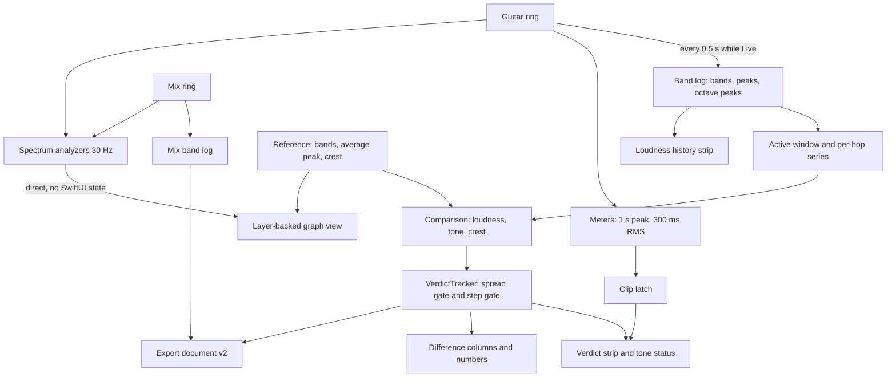
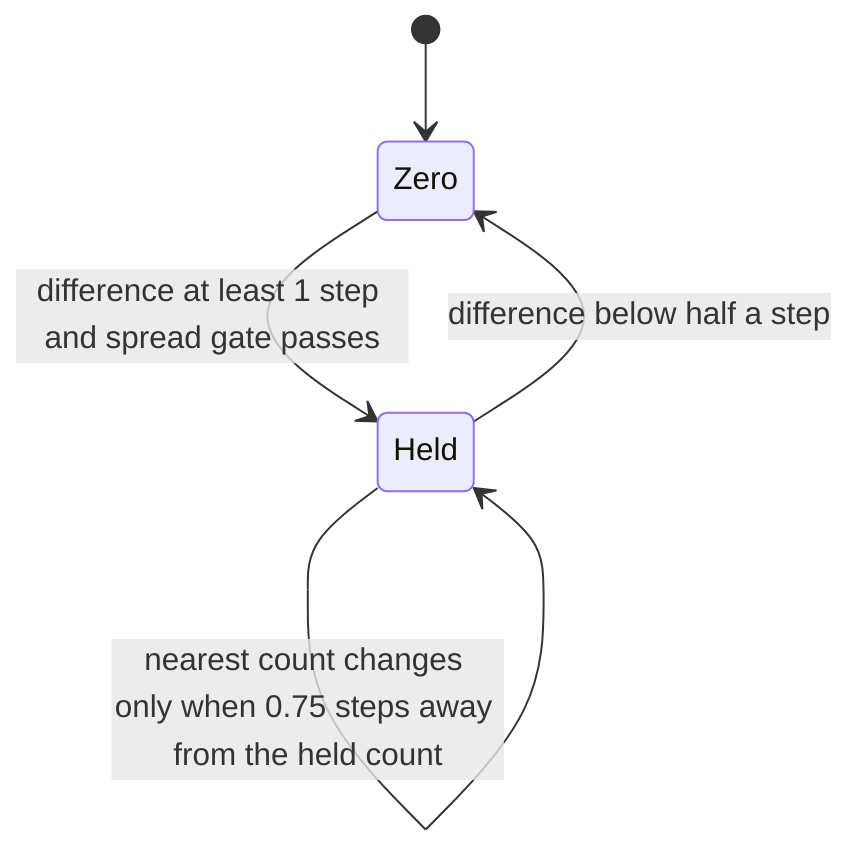
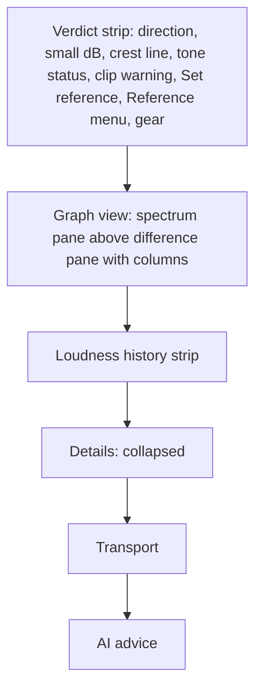
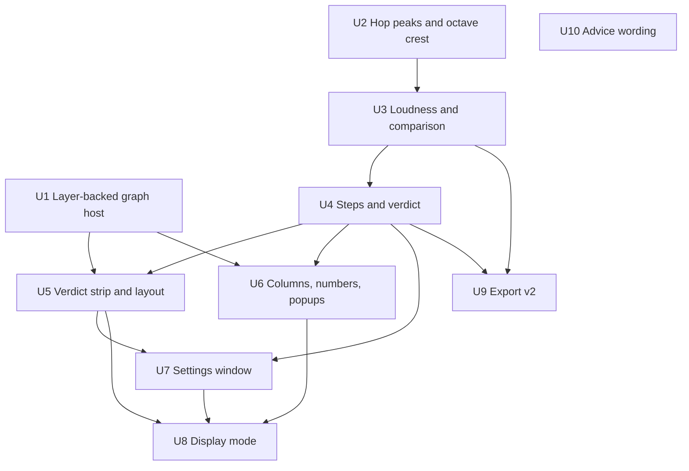

# Levels Verdict - Plan

## Goal Capsule

- **Objective:** While setting up pedals, the user sees at a glance whether the rig is at unity and whether the tone matches the reference, without reading deltas. The screen stays still and shows a check mark when nothing needs changing. The analyzer is light enough to leave running.
- **Means:** the app acts as a measuring instrument. It shows differences against the reference in action steps, splits the graph into a spectrum pane and a difference pane, and draws the curves outside the per-frame SwiftUI `Canvas` (KTD1, KTD5, KTD7).
- **Product authority:** this Product Contract. It extends `docs/plans/2026-10-06-0450-feat-pedal-setup-tools-plan.md`, whose Key Decisions and KTDs still hold unless a decision here replaces them; that plan's KTDs are cited as "pedal plan KTD<N>". It takes over the topics of `docs/plans/2026-10-06-render-performance-stub.md`. The side topics in `docs/plans/2026-10-06-agent-tuning-stub.md` are not active scope.
- **Stop conditions:** stop and ask if a requirement would need code inside an IOProc block (pedal plan KTD4's real-time rules), a network listener reachable from another machine, or saved audio. Stop if R22 is still missed after the layer-backed renderer and one profiling pass; a Metal renderer then needs the user's go-ahead.
- **Execution profile:** ten units, dependency-ordered (see Sequencing), shipped as one pull request. Pure logic is test-first with Swift Testing; the renderer, the tablet and CPU need the manual checks in the Verification Contract.
- **Tail ownership:** the executor owns tests, a working bundle, the CPU measurement in R22 and a green CI run. Releases follow `.github/workflows/ci.yml` on merge to `master`.
- **Open blockers:** none.

---

## Product Contract

**Product Contract preservation:** unchanged. The six questions deferred to planning are resolved in KTD1, KTD4, KTD7, KTD10, KTD11, KTD13 and KTD17, and were removed from the Product Contract; what stays open is in Open Questions and Deferred to Implementation.

### Summary

The levels panel becomes one verdict strip: unity by loudness in 2 dB steps, tone by octave in 1 dB steps, and a check mark when nothing needs changing.
The graph splits into a spectrum pane with the reference as a corridor and a difference pane with per-octave step counts; a loudness history strip sits below.
Everything else moves into collapsed Details or a Settings window on ⌘,.
The app reports measurements only and never picks a device or knob; the AI advice gives physical knob moves as clock positions.
Steady Live CPU drops to 5% or less.

### Problem Frame

The levels panel shows every number and button at one level, so no number reads as the answer. The user has to know what each delta means before acting.

The peak comparison is close to noise. The reference stores whatever held peak the meter showed when Set reference was pressed (`Sources/SpectrumAnalyzer/App/SpectrumAnalyzerApp.swift:299`), and the live held peak runs since the last Clear peaks. The two windows are unbounded and unrelated, so one hard strum decides the number.

Flat RMS is dominated by the 31-125 Hz octaves. A pedal that cuts bass and lifts mids reads quieter in RMS while it sounds louder, which is the opposite of how the user sets unity by ear.

One graph carries four curves on two vertical scales: dBFS on the left and a ±30 dB difference scale on the right (`Sources/SpectrumAnalyzer/UI/SpectrumGraph.swift:26`). Which curve reads against which scale is not obvious.

Steady Live costs about 18% CPU on an M-series Mac. Nearly all of it is per-frame SwiftUI overhead around the graph `Canvas`, not the DSP. A 15 Hz publish experiment gave no gain.

The AI advice gives physical knob changes in dB with a clock position in brackets. A dB value does not map to a knob, because the knob taper is different on every pedal and nobody has measured it.

### Key Decisions

- **Loudness, not flat RMS, decides unity.** It follows the ear, and bass no longer dominates. (session-settled: user-approved — chosen over flat RMS, over a switch between both, and over average peak: unity is set by ear and flat RMS over-weights the low octaves.) Governs R1.
- **Differences are shown in action steps: 2 dB for unity, 1 dB for tone.** Level knobs are physical and coarse; the EQ2 encoder moves 1 dB per click. Steps are how much to adjust, not how finely the app measures. (session-settled: user-directed — chosen over the agent's ±1 dB unity and ±2 dB tone tolerances: the steps follow the controls the user turns.) Governs R3, R7.
- **The same input gives the same answer, and "nothing to do" holds still.** Quantize to steps, gate on the measured spread, and add hysteresis. (session-settled: user-directed — chosen over colour highlighting with a fixed threshold, which flickers at the boundary.) Governs R8, R24.
- **The held peak is replaced by average peak and crest, with a clipping warning on the first level.** (session-settled: user-approved — chosen over keeping the held peak in Details and over average peak alone: crest shows how much a pedal squashes dynamics, which the held peak never could.) Governs R5, R6, R16.
- **Layout A: the verdict strip sits above the graph.** (session-settled: user-directed — chosen over a verdict card beside the graph and over a verdict-first screen with the graph collapsed, after a visual sketch of all three.) Governs R15.
- **Two panes instead of two scales on one graph; the difference pane shows a curve over octave columns.** (session-settled: user-approved — chosen over one graph, over a curve alone and over columns alone.) Governs R11, R12, R13.
- **Lessons from existing tools: reference corridor, loudness history and crest per octave.** These come from iZotope Tonal Balance Control, Youlean Loudness Meter 2 and Mastering The Mix REFERENCE 2. (session-settled: user-directed — the user took these three and rejected Tonal Balance Control's four broad zones: the rig is tuned with ten EQ2 bands, so ten octaves stay the default.) Governs R12, R14, R16.
- **The app is an instrument; decisions live outside it.** Pre-amp EQ2 sits before the drives and the ENGL preamp, so its effect on the output is nonlinear and only a closed measurement loop can choose between the two EQ2 units. That logic belongs in a portable skill, not in app code. (session-settled: user-directed — chosen over rule-based pre-amp/post-cab hints in the app.) Governs R10, R23.
- **Physical knob moves are clock positions only.** (session-settled: user-directed — chosen over dB with a knob position and over the pedal's printed scale: printed scales differ per pedal, 0-10 on one and 0-12 on another.) Governs R19.
- **Details keeps the full set for now, and the user trims it after seeing it live.** (session-settled: user-directed — chosen over dropping Details and putting only a crest line on the first level.) Governs R16.
- **The peak-hold shadow is a toggle, off by default.** It shows short spikes that the averaged curve hides, such as resonances and fizz on the attack. (session-settled: user-approved — chosen over always on and over deferring it.) Governs R12.
- **CPU target: 5% or less to accept, 1-2% desired.** (session-settled: user-approved — chosen over a hard 1-2% and over 10% or less.) Governs R22.

### Requirements

**Level verdict**

- R1. The primary level figure is the guitar's K-weighted loudness, live against the reference, over the same window of N active seconds as the reference.
- R2. The verdict shows the direction in large text ("louder → turn down" or "quieter → turn up") with the difference in whole dB in small text, or "Unity ✓".
- R3. The unity step is 2 dB and can be changed in Settings. The verdict follows the stability rule in R24.
- R4. Without a reference, the verdict asks the user to play and press Set reference. While the window fills, it shows progress such as "4 / 10 s".
- R5. A crest line under the verdict shows the change in crest factor against the reference, such as "dynamics squashed by 4 dB", only when the change is 2 dB or more.
- R6. The held peak and the Clear peaks control are removed. The first level shows a clipping warning when an input peaks near full scale.

**Tone**

- R7. Tone is compared per standard octave band (the 10 EQ2 factory bands) in 1 dB steps that can be changed in Settings, following R24.
- R8. Above each octave column of the difference pane that is out by at least one step, a signed whole-dB number shows the difference against the reference ("+2" means 2 dB above). Columns within tolerance show nothing. Nothing is colour-highlighted.
- R9. The verdict strip carries a tone status: "Tone ✓" or "Tone: N bands".
- R10. Hovering a column with the mouse, or tapping it on the tablet, opens a short popup with the band and its difference against the reference in whole dB. The popup names no device, EQ2 unit, knob or action.

**Graph**

- R11. The graph has two panes that share the frequency axis: a spectrum pane on one dBFS scale and a difference pane centred on 0 dB.
- R12. The spectrum pane shows the live guitar and the reference as a corridor of ± one tone step. Two toggles add the mix as a dim curve and a peak-hold shadow of the guitar that holds for about 1-2 s and then falls. Both toggles are off by default.
- R13. The difference pane shows guitar minus reference as a curve over the 10 octave columns. Without a reference, it shows guitar minus mix as today.
- R14. A narrow strip shows the guitar's loudness over the last minutes with the reference level as a line.

**Layout and settings**

- R15. Normal mode reads from top to bottom: the verdict strip with Set reference as its primary button, the two graph panes, the loudness history strip, collapsed Details, the transport, and the AI advice.
- R16. Details is collapsed by default. It holds third-octave differences, input meters, average peak, crest overall and per octave against the reference, and window progress.
- R17. A standard macOS Settings window opens with ⌘, and from a ⚙ button. It holds the activity thresholds with Learn noise, the window N, the unity and tone steps, and the export toggle.
- R18. Display Mode shows the verdict strip, the difference pane and the loudness history strip in large type, plus the spectrum pane when toggled on. Popups open on tap.

**Advice wording**

- R19. The AI advice gives every physical knob change as a clock position in American clock notation: 7 o'clock is minimum, 12 o'clock is centre and 5 o'clock is maximum. It never uses dB, percent or the pedal's printed scale for these knobs. EQ2 bands stay in whole dB, the EQ2 OUTPUT knob is a clock position, and switches are named by position as today.

**Export and snapshots**

- R20. The export document moves to version 2. It adds loudness, average peak, crest, the per-octave step counts, and the steps and noise bounds in use, so an agent reads the same "nothing to do" as the screen. The held-peak meaning is removed. The export stays read-only in this plan, and its shape stays open to commands.
- R21. Snapshots saved before this change still load. Their loudness verdict works from the stored band powers. Their average peak and crest differences show as unknown.

**Performance**

- R22. Steady Live uses 5% CPU or less on the user's M-series Mac with every pane visible, measured the same way as the current 18% reading.

**Instrument boundary**

- R23. App code never chooses a device, an EQ2 unit, a knob or an order of adjustment. On-screen output is measurements and differences in steps. The existing AI advice is the one exception and changes only as R19 says.
- R24. Stability rule for R3 and R7: a difference is rounded to the nearest step, and zero steps means nothing to do. A non-zero result shows only when the difference is clearly larger than its spread across the hops in the window. A figure leaves "nothing to do" at a full step and returns below half a step.

### Acceptance Examples

- AE1. **Covers R2, R3, R24.** **Given** a reference and steady playing, **when** live loudness is 0.6 dB above it, **then** the verdict reads "Unity ✓". **When** it rises to 2.3 dB above, **then** it reads "louder → turn down" with "+2 dB". **When** it falls back to 1.4 dB, **then** it still reads "louder" and turns to "Unity ✓" only below 1 dB.
- AE2. **Covers R7, R8, R24.** **Given** live playing where the 1k octave spreads by about ±2 dB across hops, **when** its difference is 1.2 dB, **then** no number shows above 1k. **Given** a repeatable input that spreads by about ±0.3 dB, **when** the difference is the same 1.2 dB, **then** "+1" shows above 1k.
- AE3. **Covers R4, R9.** **Given** no reference, **then** the verdict asks the user to play and press Set reference, and no tone status shows.
- AE4. **Covers R10, R18.** **Given** Display Mode on the tablet, **when** the user taps the 125 column, **then** a popup reads "125 Hz: −3 dB against the reference" and names no pedal.
- AE5. **Covers R21.** **Given** a snapshot saved before this change, **when** it is loaded, **then** the unity verdict and the tone numbers work, and the crest line stays hidden.

### Success Criteria

- From the tablet across the room, the user can tell "unity / turn down / turn up" and "tone OK / N bands" without reading a number.
- When the rig matches the reference, the screen shows only check marks and holds still through ordinary playing.
- R22 holds on the real rig. The user reviews the Details content live and trims it in a follow-up if needed.

### Scope Boundaries

- The AI advice keeps its behaviour except for the wording in R19. Moving it into a skill is deferred.
- Transport, scrubbing, Reset and the snapshot store keep their behaviour and only move in the layout.
- Commands in the export, the optimisation skill, MIDI control and the HX One looper as a repeatable input are deferred to `docs/plans/2026-10-06-agent-tuning-stub.md`.
- A waterfall or spectrogram view is deferred.
- A Metal renderer is in scope only if the layer-backed renderer cannot meet R22.

<!-- ce-section: work-relationships -->
### How This Work Fits Together

This plan owns the measurement and display side of the analyzer. The breakdown below reflects current understanding, not a committed roadmap.

- Agent tuning (`docs/plans/2026-10-06-agent-tuning-stub.md`)
  - Depends on R20 and R24: the agent reads the same step semantics through the export.
  - Still to decide: export commands, the skill, the MIDI closed loop and the HX One looper input.

### Sources / Research

- Held peak at the moment of Set reference: `Sources/SpectrumAnalyzer/App/SpectrumAnalyzerApp.swift:299`. Live peak handling: `Sources/SpectrumAnalyzer/Levels/LevelMeter.swift`, `Sources/SpectrumAnalyzer/Levels/LiveLevels.swift`.
- Per-hop log with no per-hop peak today: `Sources/SpectrumAnalyzer/Levels/BandLog.swift`.
- Export versioning rule (renaming or removing a field needs a version bump): `Sources/SpectrumAnalyzer/Export/LevelsDocument.swift:10`.
- Two scales on one graph: `Sources/SpectrumAnalyzer/UI/SpectrumGraph.swift:26`.
- Advice wording that R19 changes: `Sources/SpectrumAnalyzer/Advice/prompt.md`.
- No `Settings` scene today, only a `WindowGroup`: `Sources/SpectrumAnalyzer/App/SpectrumAnalyzerApp.swift:8`. A SwiftUI `Settings` scene adds the standard menu item with ⌘, (https://developer.apple.com/documentation/swiftui/settings).
- EQ2: 10 bands, each movable from 20 Hz to 20 kHz, 1 dB per encoder click: https://pedals.kyxap.pro/source-audio-eq2/#basic-operation
- Tools the lessons come from:
  - Mastering The Mix REFERENCE 2 (level match by LUFS, a level line around 0 dB, Punch Dots): https://www.masteringthemix.com/pages/reference-2-manual
  - iZotope Tonal Balance Control (target range as a band, broad and fine views): https://downloads.izotope.com/docs/ozone8/tonal-balance-control/index.html
  - ADPTR Metric AB (single, dual and layered views): https://www.plugin-alliance.com/products/metric-ab
  - Voxengo SPAN (secondary maximum spectrum in a darker colour)
  - Youlean Loudness Meter 2 (loudness history graph): https://youlean.co/wp-content/uploads/2019/04/Youlean-Loudness-Meter-2-V2.2.1-MANUAL.pdf

---

## Planning Contract

### Key Technical Decisions

- KTD1. **Loudness is K-weighted power summed from the 31 third-octave band powers.** Each band's power is scaled by the squared magnitude of the ITU-R BS.1770 K-weighting filter (shelf plus high-pass, 48 kHz coefficients, matching the fixed `HistoryRing.sampleRate`) at the band centre, summed, and expressed in dB. The weights are computed once from the filter coefficients. Live hops, the live window and a stored reference all go through the same function on band powers, so old snapshots compare on equal terms. Absolute offset is irrelevant, because only differences are shown. Governs R1, R21.
- KTD2. **`BandLog` also stores a per-hop peak and a per-octave peak and power.** For each hop, a stateless pass over the hop's own 0.5 s of frames plus 100 ms of priming runs a bank of 10 octave band-pass filters (second-order sections, one octave wide, centred on the EQ2 factory bands) and records the hop's overall peak, overall mean square, and each octave's peak and mean square. Priming removes the start transient of the 31.5 Hz band, so no filter state survives between hops and a jump in the log needs no special case. This runs on the main actor beside the existing FFT, never in an IOProc. Governs R5, R16.
- KTD3. **Average peak is the mean of per-hop peaks in dBFS over the active hops of the window; crest is average peak minus the window's RMS in dB.** Dropping to dB before averaging keeps one hard strum from deciding the figure. Per-octave crest uses the octave's own average peak and mean square. Crest differences against the reference are live minus reference, so negative reads "squashed". Governs R5, R16.
- KTD4. **Spread gate: a figure's spread is the sample standard deviation of its per-hop differences; a non-zero step count shows only when the window mean is at least 1.5 times that spread, and only from 4 active hops (2 s).** For the unity figure the per-hop value is hop loudness minus the reference loudness; for a tone column it is the hop's octave level minus the reference's octave level. Below 4 hops the figure is unknown and the strip shows window progress (R4). The 1.5 factor is one named constant, tuned on the rig. The gate is sample-deviation based, not standard-error based, because AE2 requires a 1.2 dB difference under ±2 dB spread to stay hidden. (session-settled: user-approved — chosen over a gate that shows every difference of two or more steps whatever the spread: the Product Contract's R24 hides any non-zero result under a large spread, and the stricter rule stays the baseline until the rig shows false check marks.) Governs R24.
- KTD5. **A step gate turns a raw difference into a held step count.** Entering a non-zero count needs a full step and the spread gate. Leaving to zero needs less than half a step; the spread gate does not apply while a count is held. A held count k moves to the nearest count only when the raw difference in steps is at least 0.75 from k, which stops flicker at 1.5 steps. The strip shows steps multiplied by the step size, so the unity figure reads +2 or +4 dB, never a free whole-dB value. The gate advances once per new log hop, not once per UI tick, so the same hop series gives the same answer. The crest line reuses the gate with a 2 dB step and no spread gate. Changing a step setting, Reset, Set reference or loading a snapshot clears every held count. (session-settled: user-directed — hysteresis kept; chosen over plain rounding to the nearest step, which flickers at the boundary. session-settled: user-directed — the small dB figure under the unity verdict stays as a measurement, chosen over a verdict with no dB on screen.) Governs R2, R3, R5, R7, R24.
- KTD6. **One `VerdictTracker`, owned by `AppModel`, feeds the screen and the export.** It takes the comparison and the per-hop series and produces a value `Verdict`: the unity figure, ten tone figures, the crest figure, window progress and the step sizes in use. The screen reads the value from `LiveLevels`; the export document is built from the same value. It holds the held counts (KTD5) and nothing else, so it stays testable without audio. Governs R20, R24.
- KTD7. **The graph is a layer-backed `NSView` hosted in SwiftUI; the 30 Hz path never touches SwiftUI state.** Grid, curves, corridor, peak-hold shadow and columns are `CAShapeLayer` and `CATextLayer` sublayers of one view, so both panes share the x axis. `AppModel.tick` hands each frame straight to the view, which replaces layer paths with implicit animations off. `LiveCurves` stops being an `ObservableObject`. The history strip updates only when a hop lands (2 Hz) and stays a SwiftUI `Canvas` in its own view. A `CAMetalLayer` renderer is out unless the stop condition in the Goal Capsule fires. Governs R11, R22.
- KTD8. **Pane geometry.** The spectrum pane keeps today's dBFS scale (floor −100 dB, grid 0 to −80 dB). The difference pane is centred on 0 dB with ±12 dB at its edges and clamps beyond, matching the bars it replaces. The panes split the height 60 / 40, share the 10 octave gridlines and labels, and the 10 columns sit on the octave centres, each as wide as one octave on the log axis. Governs R11, R13.
- KTD9. **Corridor and peak-hold constants.** The corridor is the reference's display curve plus and minus the tone step, drawn as a filled band. The peak-hold shadow follows the live guitar display curve upward at once, holds 1.5 s, then falls 20 dB per second, per display point. Both toggles and the mix curve toggle are remembered and off by default. Governs R12.
- KTD10. **Clipping warning: an input whose 1 s peak reaches −1 dBFS latches the warning for 3 s.** Both the guitar and the mix input are watched, and the warning names which. The latch lives in `LiveLevels` and ticks with the 10 Hz meter refresh; the shown meter peak is the plain 1 s peak, no longer held. Governs R6.
- KTD11. **The loudness history strip shows the last 5 minutes of the guitar log.** Each hop plots its K-weighted loudness (KTD1); hops below the threshold plot dim, the reference loudness is a horizontal line, and Reset empties the strip with the log. Governs R14.
- KTD12. **`Reference` drops the held peak and gains optional average peak, crest and per-octave crest.** Synthesised `Codable` ignores the removed key and leaves new optionals nil, so old snapshot files decode unchanged and `SnapshotStore` needs no migration. Loudness is never stored; it is derived from `guitarBands` (KTD1). Governs R6, R21.
- KTD13. **Settings is a SwiftUI `Settings` scene sharing the `AppModel` instance.** One form view serves the scene and the More sheet in display mode. Step sizes are whole dB, unity 1 to 6 (default 2), tone 1 to 3 (default 1), stored in `UserDefaults`. Set reference, Save as and Snapshots sit in the verdict strip, with Save as and Snapshots under a Reference menu. Governs R3, R7, R15, R17.
- KTD14. **Export version 2 adds a `verdict` object and keeps the document extensible.** The verdict object carries the unity figure, the ten tone figures (raw difference, spread, steps), the crest figure, window progress and the step sizes, spread factor and minimum hop count in use. Per-source sections gain loudness and average peak; the reference gains loudness, average peak and crest; the reference's held `peakDBFS` is removed, and each source's `peakDBFS` is documented as the 1 s peak. A reference loaded from an old snapshot reports null for what it lacks. Governs R20, R21.
- KTD15. **R19 covers rotary knobs only.** Parameters set on a device display or in software keep their own units: the Mooer Cab X2 level in percent, the RC-5 loop level, and the mix playback volume. EQ2 bands stay in whole dB and EQ2 OUTPUT is a clock position. The shipped starting positions drop the dB and "unity" parentheticals on rotary knobs. (session-settled: user-approved — chosen over putting every parameter on a clock: a display value has no knob to turn.) Governs R19.
- KTD16. **One pull request carries all ten units.** (session-settled: user-directed — chosen over staged pull requests: a clean `master` history is not wanted, the result is.) Governs the whole plan.
- KTD17. **R22 is measured with the earlier method.** Build with `scripts/bundle.sh`, launch the bundle, wait 8 s, then sample `ps -o %cpu=,rss= -p <pid>` every 15 s for at least 8 samples. macOS reports `%cpu` as a decaying average over up to a minute, so the first samples after launch are discarded. Governs R22.

### High-Level Technical Design

Data flow from the logs to the screen and the export:

One figure's held count (KTD5), shown for the unity figure at 2 dB steps:

Normal-mode composition (R15):

### Sequencing

U1, U2 and U10 start independently. U1 comes first because it carries the CPU stop condition: if R22 is missed after it, nothing after it changes that. Units land as separate commits in one pull request.

### System-Wide Impact

- **Main-thread load:** the log adds a 10-band filter pass per hop per source beside its FFT, 4 passes a second in all. The 30 Hz tick stops publishing curves to SwiftUI. Nothing touches the IOProc path, so pedal plan KTD4 holds.
- **Export consumers:** version 2 removes the reference's `peakDBFS`. No consumer ships yet; the agent skill is deferred, so v1 readers are only ad hoc scripts.
- **Stored state:** new `UserDefaults` keys for the unity and tone steps, the mix and peak-hold toggles and the display-mode spectrum toggle. `snapshots.json` gains optional fields and loses one key on write; old files still read.
- **Removed UI:** Clear peaks and the tap-to-clear peaks gesture, the ±30 dB right-edge scale, and the standalone threshold and export controls in the panel (they move to Settings).
- **AI payload:** the band table is unchanged; the instruction and the starting positions change wording only (U10).

### Risks & Dependencies

| Risk | Mitigation |
|---|---|
| The spread gate hides real offsets under dynamic playing: a large per-hop spread keeps "Unity ✓" or "Tone ✓" on although the rig is off. | The factor and the 4-hop floor are named constants. Details keeps ungated third-octave differences. Checked on the rig in the Verification Contract; the alternative rule is an Open Question. |
| The layer-backed renderer still misses 5%. | Profile once with `sample`; the stop condition then asks before any Metal work. |
| Octave filters cost more than estimated or ring at low bands. | Stateless priming (KTD2); the CPU check runs after U2 and again at the end. |
| `Settings` scene or ⌘, behaves differently outside a bundled app. | Verified on the bundle from `scripts/bundle.sh`, not on `swift run`. |
| Hover and tap on a layer-backed view over Side Screen arrive as plain clicks. | Popups open on mouse-down as well as hover (U6); checked on the tablet. |
| The 640 x 420 minimum window cannot hold the new strip, panes and history. | Details is collapsed and the history strip is short; the window minimum is raised only if a manual check shows clipping. |

### Open Questions

- Non-blocking. Whether differences of two or more steps should show whatever the spread (the alternative to KTD4). Decided after the rig check in the Verification Contract; the baseline ships first.

### Deferred to Implementation

- Octave filter coefficients and Q, after checking each band's pass-band against the EQ2 factory band edges.
- The spread factor value (1.5 is the starting point) and the 4-hop floor, tuned on the rig.
- Wording of the crest line for a positive change, the clipping text, and the popup layer's look.
- Type sizes of the strip and Details in normal and display mode.
- The exact `Settings` form layout and where the gear button sits in the strip.

---

## Implementation Units

| Unit | Title | Key files | Depends on |
|---|---|---|---|
| U1 | Layer-backed graph host | `UI/GraphLayerView.swift`, `UI/SpectrumGraph.swift` | none |
| U2 | Hop peaks and octave crest | `Levels/BandLog.swift`, `Analysis/OctaveFilters.swift` | none |
| U3 | Loudness and comparison | `Levels/Loudness.swift`, `Levels/Reference.swift` | U2 |
| U4 | Steps and verdict | `Levels/Verdict.swift` | U3 |
| U5 | Verdict strip and layout | `UI/VerdictStrip.swift`, `UI/HistoryStrip.swift`, `UI/LevelsPanel.swift` | U1, U4 |
| U6 | Columns, numbers and popups | `UI/GraphLayerView.swift`, `UI/SpectrumGraph.swift` | U1, U4 |
| U7 | Settings window | `UI/SettingsView.swift`, `App/SpectrumAnalyzerApp.swift` | U4, U5 |
| U8 | Display mode | `UI/DisplayMode.swift` | U5, U6, U7 |
| U9 | Export v2 | `Export/LevelsDocument.swift`, `README.md` | U3, U4 |
| U10 | Advice wording | `Advice/prompt.md`, `Advice/starting-positions.md` | none |

All paths below are under `Sources/SpectrumAnalyzer/` and `Tests/SpectrumAnalyzerTests/`.

### U1. Layer-backed graph host

- **Goal:** the graph draws as two panes from layers updated directly by the tick, and steady Live CPU is measured against R22.
- **Requirements:** R11, R12, R13, R22. KTD7, KTD8, KTD9, KTD17.
- **Dependencies:** none.
- **Files:**
  - `Sources/SpectrumAnalyzer/UI/GraphLayerView.swift` (new)
  - `Sources/SpectrumAnalyzer/UI/SpectrumGraph.swift`
  - `Sources/SpectrumAnalyzer/Levels/LiveLevels.swift`
  - `Sources/SpectrumAnalyzer/App/SpectrumAnalyzerApp.swift`
  - `Sources/SpectrumAnalyzer/UI/ControlsBar.swift`
  - `Tests/SpectrumAnalyzerTests/GraphScaleTests.swift`
  - `Tests/SpectrumAnalyzerTests/PeakHoldTests.swift` (new)
- **Approach:**
  1. `GraphLayerView` is an `NSView` with a grid layer, two pane layers and curve sublayers, wrapped in an `NSViewRepresentable`. It takes a frame value (guitar, mix, reference, difference points; toggles; tone step) and replaces paths inside a `CATransaction` with actions disabled.
  2. `GraphScale` gains the pane split, the difference pane's ±12 dB mapping and corridor bounds; the old right-edge ±30 dB mapping and labels go.
  3. A pure `PeakHold` value updates the shadow per display point from each new guitar curve.
  4. `AppModel.tick` pushes the frame to the view through a small sink object in place of `LiveCurves`'s `@Published` properties; the sink remembers the latest frame for resizes.
  5. `AppModel` gains the stored tone step (default 1 dB) that sizes the corridor; U7 exposes it in Settings.
  6. `ControlsBar` swaps the Difference toggle for the Mix and Peak hold toggles; both are remembered and off by default. Difference shows in its pane always.
  7. Measure with KTD17 on the built bundle. Record the numbers in the pull request.
- **Execution note:** run the CPU measurement at the end of this unit before starting U2; a miss triggers the stop condition.
- **Patterns to follow:** `GraphScale`'s pure mappings, `setIfChanged` for anything still published, `ScreenReader`'s `NSViewRepresentable` wiring in `UI/DisplayMode.swift`.
- **Test scenarios:**
  - The difference pane maps 0 dB to its middle, +12 dB to its top edge and −12 dB to its bottom edge, and clamps beyond.
  - The pane split puts the spectrum pane above the difference pane and covers the full height with no gap.
  - Corridor bounds equal the reference curve plus and minus the tone step at every display point.
  - Peak hold: a rising curve is followed at once, a falling curve is held for 1.5 s, then falls 20 dB per second.
  - Peak hold restarts from the live curve after a jump (scrub or Reset).
  - Grid labels still read "31", "62", "125", "250", "500", "1k", "2k", "4k", "8k", "16k".
- **Verification:** the scenarios pass; the app shows both panes with curves moving; steady Live CPU from KTD17 is 5% or less, or the stop condition is raised.

### U2. Hop peaks and octave crest

- **Goal:** each log hop carries its peak and per-octave peak and mean square, and a window reports average peak and crest overall and per octave.
- **Requirements:** R5, R16. KTD2, KTD3.
- **Dependencies:** none.
- **Files:**
  - `Sources/SpectrumAnalyzer/Analysis/OctaveFilters.swift` (new)
  - `Sources/SpectrumAnalyzer/Levels/BandLog.swift`
  - `Tests/SpectrumAnalyzerTests/OctaveFilterTests.swift` (new)
  - `Tests/SpectrumAnalyzerTests/BandLogTests.swift`
- **Approach:**
  1. `OctaveFilters` runs the 10 band-pass sections over a frame range with a priming prefix and returns each band's peak and mean square.
  2. `LogHop` gains the hop's peak (dBFS), mean square, and the 10 octave peaks and mean squares; `BandLog.append` reads the hop's frames plus priming and fills them.
  3. `ActiveWindow` gains average peak, crest, per-octave average peak and per-octave crest, computed as KTD3 states.
- **Execution note:** write the filter tests first against synthetic sines and clicks from `AudioFixtures`.
- **Patterns to follow:** `BandLog.append`'s single read of the ring, `AudioFixtures.writeSine`, and the pure-logic style of `BandLogTests`.
- **Test scenarios:**
  - A 1 kHz sine at −20 dBFS gives a hop peak near −20 dBFS and a 1k octave peak within 1 dB of it, with the 500 and 2k octaves at least 6 dB lower.
  - A steady sine's overall crest reads about 3 dB; the same sine plus one full-scale click per hop reads at least 12 dB.
  - Two successive hops of a steady 31.5 Hz sine give octave peaks within 0.5 dB of each other, so priming leaves no start transient.
  - A click 0.4 s before the hop end counts in that hop's peak.
  - Three active hops with peaks −10, −10 and −4 dBFS give an average peak of −8 dBFS.
  - A window's crest equals its average peak minus its RMS in dB, and an octave's crest uses that octave's own figures.
  - Hops below the threshold stay out of the average peak and crest.
  - A window with no active hop reports unknown for average peak and crest, not zero.
- **Verification:** the scenarios pass; the log's per-hop cost with the filter bank stays small next to the FFT in the CPU check at the end.

### U3. Loudness and comparison

- **Goal:** the comparison reads K-weighted loudness, average peak and crest against the reference, the held peak is gone, and old snapshots still load.
- **Requirements:** R1, R5, R6, R16, R21, AE5. KTD1, KTD3, KTD12.
- **Dependencies:** U2.
- **Files:**
  - `Sources/SpectrumAnalyzer/Levels/Loudness.swift` (new)
  - `Sources/SpectrumAnalyzer/Levels/Reference.swift`
  - `Sources/SpectrumAnalyzer/Levels/LevelMeter.swift`
  - `Sources/SpectrumAnalyzer/Levels/LiveLevels.swift`
  - `Sources/SpectrumAnalyzer/App/SpectrumAnalyzerApp.swift`
  - `Sources/SpectrumAnalyzer/Export/LevelsDocument.swift`
  - `Tests/SpectrumAnalyzerTests/LoudnessTests.swift` (new)
  - `Tests/SpectrumAnalyzerTests/ReferenceTests.swift`
  - `Tests/SpectrumAnalyzerTests/LevelMeterTests.swift`
  - `Tests/SpectrumAnalyzerTests/SnapshotStoreTests.swift`
  - `Tests/SpectrumAnalyzerTests/ExportTests.swift`
- **Approach:**
  1. `Loudness` builds the 31 weights from the BS.1770 K-weighting at 48 kHz once and maps band powers to dB.
  2. `Reference` drops `guitarPeakDBFS`, gains optional average peak, crest and per-octave crest, and `make` fills them from the window. `Comparison` gains loudness difference, average-peak and crest differences (live minus reference) and the per-hop series the tracker needs; the flat level difference stays for Details.
  3. `LevelReading` loses the held peak: the shown peak is the plain 1 s peak. `LiveLevels.clearPeaks` and its callers go; `setReference` stops passing a peak.
  4. `LevelsDocument` stops writing the reference's `peakDBFS` so the build holds; U9 owns the version bump and the rest of the document.
- **Patterns to follow:** `OctaveBands.power(fromBands:)` for band-power maths and the existing `Comparison.make` shape.
- **Test scenarios:**
  - The weights match the standard's published K-weighting response at 1 kHz (about +0.7 dB, the figure behind BS.1770's −0.691 offset) and at 31.5 Hz (below 0 dB).
  - Equal-level sines at 100 Hz and 3 kHz read at least 3 dB apart, the 3 kHz one louder.
  - Loudness of a window's averaged bands equals the power-mean of its hops' loudness values within 0.1 dB.
  - A pedal that cuts 125 Hz by 6 dB and lifts 2 kHz by 6 dB at equal flat RMS reads louder in loudness while flat RMS difference stays near 0.
  - Covers AE5. A snapshot JSON written with the old shape, including the removed peak key and no crest fields, decodes; its loudness difference works from `guitarBands` and its crest and average-peak differences are unknown.
  - A reference made from a current window carries average peak and crest and round-trips through `SnapshotStore`.
  - A burst followed by 1.2 s of silence reads minus infinity peak; the peak is no longer held.
  - Comparison with a reference lacking crest data reports crest difference as unknown, not 0 dB.
- **Verification:** the scenarios pass and the whole suite still builds, including the trimmed export tests.

### U4. Steps and verdict

- **Goal:** the app produces one stable verdict value from the comparison, shared by screen and export.
- **Requirements:** R2, R3, R4, R5, R7, R9, R24, AE1, AE2, AE3. KTD4, KTD5, KTD6.
- **Dependencies:** U3.
- **Files:**
  - `Sources/SpectrumAnalyzer/Levels/Verdict.swift` (new)
  - `Sources/SpectrumAnalyzer/Levels/Reference.swift`
  - `Sources/SpectrumAnalyzer/Levels/LiveLevels.swift`
  - `Sources/SpectrumAnalyzer/App/SpectrumAnalyzerApp.swift`
  - `Tests/SpectrumAnalyzerTests/VerdictTests.swift` (new)
- **Approach:**
  1. `Verdict.swift` holds the spread statistic, the step gate and the `VerdictTracker` from KTD4 to KTD6 with the unity, tone and crest figures.
  2. `AppModel` owns the tracker, feeds it when the guitar log gains a hop and when a setting or the reference changes, and publishes the resulting `Verdict` through `LiveLevels`.
  3. `AppModel` gains the stored unity step (default 2 dB) next to the tone step from U1; U7 puts both in Settings.
- **Execution note:** implement the gate and tracker test-first; the scenarios below are the spec.
- **Patterns to follow:** the pure value style of `DisplayModeMemory` and `Comparison`.
- **Test scenarios:**
  - Covers AE1. With a 2 dB unity step and tight spread, differences 0.6, 2.3, 1.4 and 0.9 dB in turn read zero, +1 step ("+2 dB"), still +1 step, then zero.
  - Covers AE2. A tone series with mean 1.2 dB and spread about 1.4 dB leaves the count at zero; the same mean with spread about 0.2 dB gives +1 step.
  - Fewer than 4 active hops give an unknown figure, whatever the difference.
  - A held +1 count survives a drift from 2.9 to 3.1 to 2.9 dB at a 2 dB step, moves to +2 only at 3.5 dB and back to +1 only below 2.5 dB.
  - A held count leaves to zero only below half a step, and a spread that grows while a count is held does not clear it.
  - A held +1 moves straight to −1 when the difference reaches −1 step.
  - Updating twice with the same last hop sequence changes nothing; a new hop advances the gate.
  - Replaying the same hop series after a clear gives the same figures as the first pass.
  - Changing a step size, Reset, Set reference or loading a snapshot clears the held counts.
  - The tone count equals the number of non-zero columns, and zero columns give "Tone ✓" input.
  - Covers AE3. With no reference the verdict is absent: no unity, no tone, no crest.
  - The crest figure shows at a change of 2 dB or more, holds until the change falls below 1 dB, and reads unknown for a reference without crest data.
- **Verification:** the scenarios pass; with a reference set and steady playing on the rig, the figures sit still.

### U5. Verdict strip and layout

- **Goal:** normal mode reads top to bottom as the verdict strip, the panes, the history strip, collapsed Details, the transport and the AI advice.
- **Requirements:** R2, R4, R5, R6, R9, R14, R15, R16, AE3. KTD10, KTD11, KTD13.
- **Dependencies:** U1, U4.
- **Files:**
  - `Sources/SpectrumAnalyzer/UI/VerdictStrip.swift` (new)
  - `Sources/SpectrumAnalyzer/UI/HistoryStrip.swift` (new)
  - `Sources/SpectrumAnalyzer/UI/LevelsPanel.swift`
  - `Sources/SpectrumAnalyzer/Levels/LiveLevels.swift`
  - `Sources/SpectrumAnalyzer/App/SpectrumAnalyzerApp.swift`
  - `Tests/SpectrumAnalyzerTests/VerdictTextTests.swift` (new)
  - `Tests/SpectrumAnalyzerTests/ClipLatchTests.swift` (new)
  - `Tests/SpectrumAnalyzerTests/HistoryStripTests.swift` (new)
- **Approach:**
  1. `VerdictStrip` shows direction in large text with the small dB figure, "Unity ✓", the crest line, the tone status, the clip warning, a prominent Set reference, a Reference menu (Clear, Save as…, Snapshots…) and the ⚙ button. A pure `VerdictText` maps a `Verdict` to its strings.
  2. `HistoryStrip` draws the last 5 minutes from the guitar log and the reference line; it is its own view fed at hop rate.
  3. `LevelsPanel` is reorganised: Details (disclosure, collapsed) holds third-octave differences, the input meters with RMS and plain peak, average peak and crest overall and per octave against the reference, and window progress. Clear peaks, the tap-to-clear gesture and the standalone controls go.
  4. The clip latch is added to `LiveLevels` per KTD10.
  5. `ContentView`'s normal layout follows R15; the existing split view keeps the AI advice at the bottom.
- **Patterns to follow:** `LevelsPanel`'s split between observed fast views and the unobserved panel, and `DisplaySizes` for type sizes.
- **Test scenarios:**
  - `VerdictText` renders "louder → turn down" with "+2 dB", "quieter → turn up" with "−2 dB", and "Unity ✓".
  - `VerdictText` renders "Tone ✓" and "Tone: 2 bands", and shows no tone status without a reference.
  - Covers AE3. With no reference the text asks the user to play and press Set reference; while the window fills it shows "4 / 10 s".
  - The crest line reads "dynamics squashed by 4 dB" for −4 dB and stays empty below 2 dB.
  - A 1 s peak at −0.5 dBFS latches the warning; it clears 3 s after the last such peak, and a peak at −2 dBFS never latches it.
  - The warning names the input that clipped, and both inputs can warn at once.
  - History strip geometry spans 5 minutes, plots hops left to right by end frame, and puts the reference line at the reference loudness.
  - Reset empties the history strip.
- **Verification:** the scenarios pass; on the running app the order matches R15 and Details starts collapsed; steady Live CPU is re-measured per KTD17.

### U6. Columns, numbers and popups

- **Goal:** the difference pane shows octave columns with step numbers, and a column opens a popup on hover or tap.
- **Requirements:** R8, R10, R13, AE4. KTD5, KTD8.
- **Dependencies:** U1, U4.
- **Files:**
  - `Sources/SpectrumAnalyzer/UI/GraphLayerView.swift`
  - `Sources/SpectrumAnalyzer/UI/SpectrumGraph.swift`
  - `Tests/SpectrumAnalyzerTests/GraphScaleTests.swift`
  - `Tests/SpectrumAnalyzerTests/ColumnPopupTests.swift` (new)
- **Approach:**
  1. With a reference, the difference pane draws the guitar-minus-reference curve over 10 columns on the octave centres, each column a bar of its octave difference; without a reference only the guitar-minus-mix curve shows and popups are off.
  2. A column whose held count is non-zero gets a signed number above it, steps times the tone step; zero columns show nothing and nothing is coloured.
  3. The view reports the column under the pointer on mouse move and on mouse down; a pure function maps x to a column and builds the popup text from the raw difference.
- **Patterns to follow:** `GraphScale.x(forHz:width:)` for column placement.
- **Test scenarios:**
  - An x position maps to the octave column whose band contains it, and positions outside the 10 octaves map to none.
  - A held +2 steps at a 1 dB tone step labels its column "+2"; at a 2 dB step it labels "+4".
  - Columns with a zero count carry no label and no highlight state.
  - Covers AE4. Popup text for the 125 column with a −3.2 dB raw difference reads "125 Hz: −3 dB against the reference", with a true minus sign and no device name.
  - The popup shows the raw whole-dB difference even when the column's count is zero.
  - With no reference no column is hit-testable and no popup opens.
- **Verification:** the scenarios pass; on the running app, hover opens the popup and a click opens it as well.

### U7. Settings window

- **Goal:** a standard Settings window holds the thresholds, Learn noise, N, the steps and the export toggle.
- **Requirements:** R3, R7, R17. KTD13.
- **Dependencies:** U4, U5.
- **Files:**
  - `Sources/SpectrumAnalyzer/UI/SettingsView.swift` (new)
  - `Sources/SpectrumAnalyzer/App/SpectrumAnalyzerApp.swift`
  - `Sources/SpectrumAnalyzer/UI/LevelsPanel.swift`
  - `Tests/SpectrumAnalyzerTests/StepSettingsTests.swift` (new)
- **Approach:**
  1. `SpectrumAnalyzerApp` adds a `Settings` scene with `SettingsView(model:)`; the strip's ⚙ button opens it with the standard action.
  2. `SettingsView` takes over `LevelsControls`' thresholds with Learn noise, the N picker and the export toggle with its status, and adds the unity and tone step steppers.
  3. A small `StepSettings` clamp keeps stored steps whole and in range.
- **Patterns to follow:** the existing `thresholdField` and export toggle code moved from `LevelsControls`.
- **Test scenarios:**
  - The unity step defaults to 2 and the tone step to 1.
  - Stored steps clamp to 1...6 and 1...3 and round to whole dB; a stored 0 or 9 reads back clamped.
  - A step change reaches the tracker and clears its held counts.
  - The N picker offers 5, 10 and 20 and keeps its remembered value.
- **Verification:** the scenarios pass; ⌘, and the ⚙ button both open the window on the built bundle.

### U8. Display mode

- **Goal:** display mode shows the verdict strip, the difference pane and the history strip large, the spectrum pane on a toggle, and popups on tap.
- **Requirements:** R18, AE4. KTD13.
- **Dependencies:** U5, U6, U7.
- **Files:**
  - `Sources/SpectrumAnalyzer/UI/DisplayMode.swift`
  - `Sources/SpectrumAnalyzer/App/SpectrumAnalyzerApp.swift`
  - `Sources/SpectrumAnalyzer/UI/GraphLayerView.swift`
  - `Tests/SpectrumAnalyzerTests/DisplayModeTests.swift`
- **Approach:**
  1. A pure function lists the visible regions for a layout: normal shows all, display shows the strip, the difference pane and the history strip, plus the spectrum pane when its remembered toggle is on.
  2. `ContentView`'s display layout uses it; the spectrum toggle sits in the More sheet beside the shared settings form.
  3. `DisplaySizes` grows the strip and column number fonts; the touch row keeps Pause, Resume live, Set reference, Reset and More.
- **Patterns to follow:** `DisplayModeMemory` and `DisplaySizes`.
- **Test scenarios:**
  - Display layout without the spectrum toggle lists strip, difference pane and history strip only.
  - With the toggle on, the spectrum pane is added above the difference pane.
  - The spectrum toggle persists across a new model instance.
  - Existing screen-memory scenarios for display mode still pass.
- **Verification:** the scenarios pass; on the tablet, the verdict reads from about 2 m and a tap on a column opens the popup.

### U9. Export v2

- **Goal:** the local export serves version 2 with the verdict and the quantities R20 names.
- **Requirements:** R20, R21. KTD12, KTD14.
- **Dependencies:** U3, U4.
- **Files:**
  - `Sources/SpectrumAnalyzer/Export/LevelsDocument.swift`
  - `Sources/SpectrumAnalyzer/App/SpectrumAnalyzerApp.swift`
  - `README.md`
  - `Tests/SpectrumAnalyzerTests/ExportTests.swift`
- **Approach:**
  1. Bump `version` to 2; add loudness and average peak to each source, loudness, average peak and crest to the reference, and the `verdict` object from KTD14. Drop the reference's `peakDBFS`; document each source's `peakDBFS` as the 1 s peak in `units`.
  2. `refreshExport` passes the tracker's `Verdict`; the export refresh triggers include a verdict change.
  3. README's export section names version 2 and the verdict fields.
- **Patterns to follow:** the object-literal style of `LevelsDocument.make` and `referenceSection`.
- **Test scenarios:**
  - The document has version 2 and no reference `peakDBFS`; each source still has a 1 s `peakDBFS`.
  - With a reference and a held +1 unity count, the verdict object reports steps 1, the raw difference, the spread and the step sizes, the spread factor and the minimum hop count in use.
  - Ten tone figures are present, each with raw difference, spread and steps, and the tone count matches the screen.
  - A reference from an old snapshot reports null average peak and crest and a working loudness.
  - With no reference the verdict object is null.
  - Existing shape scenarios (31 centres, 10 octave centres, loopback server behaviour) still pass.
- **Verification:** the scenarios pass; by hand, `curl http://127.0.0.1:47800/levels` returns version 2 with a verdict that matches the screen.

### U10. Advice wording

- **Goal:** the AI advice gives knob moves as clock positions only, with EQ2 bands in whole dB.
- **Requirements:** R19. KTD15.
- **Dependencies:** none.
- **Files:**
  - `Sources/SpectrumAnalyzer/Advice/prompt.md`
  - `Sources/SpectrumAnalyzer/Advice/starting-positions.md`
  - `Tests/SpectrumAnalyzerTests/PayloadTests.swift`
- **Approach:**
  1. Rewrite the level and volume sentence and the EQ2 OUTPUT sentence in `prompt.md` so every rotary knob move is a clock position, dropping "in dB with the knob move in parentheses" and its example.
  2. Remove the dB and unity parentheticals on rotary knobs in `starting-positions.md` (the Terraform volume line); leave EQ2 bands, the Cab X2, the RC-5 and the mix playback volume in their own units.
- **Patterns to follow:** the existing prompt assertions in `PayloadTests`.
- **Test scenarios:**
  - The shipped prompt tells the model to give knob moves as clock positions and no longer contains the sentence about dB with a knob move in parentheses.
  - The shipped prompt still asks for EQ2 band changes in whole dB and still names the EQ2 OUTPUT as a clock position.
  - No starting-position line outside the EQ2, Cab X2, RC-5 and mix playback entries contains "dB" or "%".
  - Existing scenarios (no GE-7, Matcha or Bad Horse, no "2.5 dB", positions section after the rig state) still pass.
- **Verification:** the scenarios pass; one real recommendation on the rig gives clock positions for the booster and amp knobs and whole dB for EQ2 bands.

---

## Verification Contract

| Check | How | Applies to |
|---|---|---|
| Unit tests | `./scripts/test.sh` runs the Swift Testing suite; run each unit's files, then the whole suite before the pull request. Plain `swift test` runs no tests on this machine. | U1-U10 |
| CI | `.github/workflows/ci.yml` runs `swift test` and `scripts/bundle.sh` on the pull request | all |
| CPU | KTD17 on the built bundle: after U1 (stop condition) and at the end with every pane visible, Live, steady input; numbers go in the pull request | U1, U5, final |
| Rig run | F1 from the pedal plan on the real rig: Learn noise, Set reference, switch a pedal on, turn to "Unity ✓"; check the figures hold still on steady playing and note any false check mark | U3-U6 |
| Tablet | Display mode through Side Screen: verdict readable from about 2 m, tap on a column opens the popup | U6, U8 |
| Settings | ⌘, and ⚙ open the window on the bundle; step changes alter the verdict | U7 |
| Export | `curl http://127.0.0.1:47800/levels` returns version 2 and a verdict that matches the screen | U9 |
| AI request | One real recommendation: clock positions for rotary knobs, whole dB for EQ2 bands | U10 |

---

## Definition of Done

- Every unit's test scenarios exist and pass under `./scripts/test.sh`, and CI is green on the pull request.
- Every R-ID and AE-ID in the Product Contract is met, checked by the scenarios or the manual rows above.
- R22 is measured with KTD17 on the final build and is 5% or less, or the stop condition was raised and the user decided.
- The manual rows ran and their outcomes, including any false check mark seen on the rig, are written in the pull request description.
- No IOProc code changed, and capture still follows pedal plan KTD4.
- Clear peaks, the held peak and the right-edge ±30 dB scale are gone from code and UI.
- Code from abandoned attempts is removed, with no unused helpers, dead flags or commented-out blocks left in the diff.
